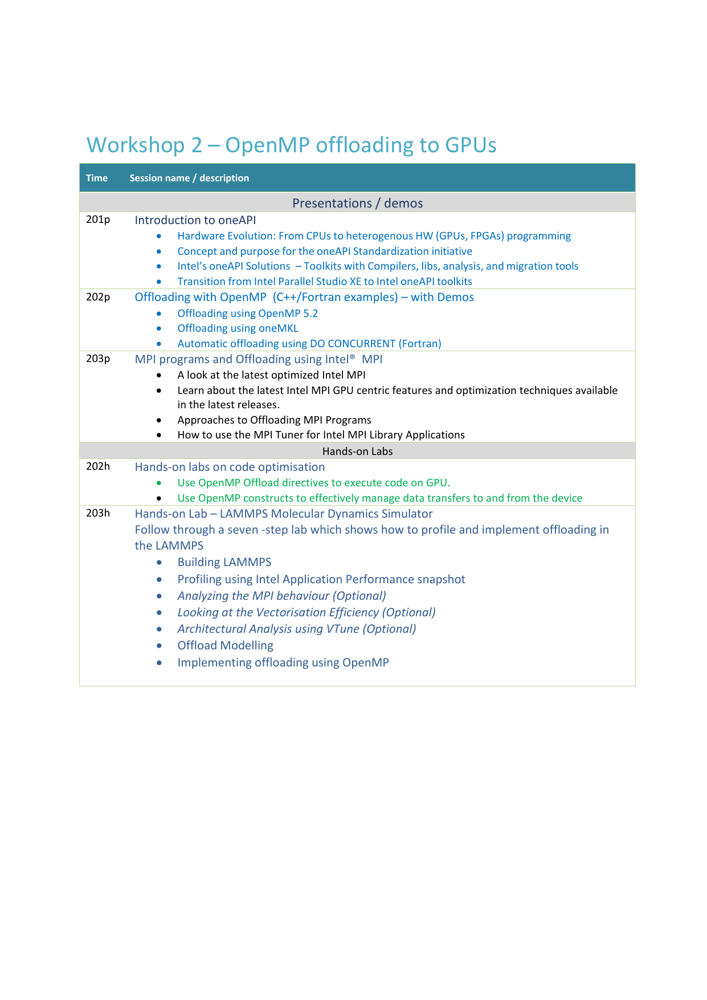

# Programming with oneAPI

The contents of the workshop are as follows:

## Date

The workshop will be held on 21st October, 2024.

## Time

The workshop timings are from 10:00 AM to 4:00 PM.

**Schedule:**

The full schedule with catering details is given below:

|S.NO  | Activity  | Time |
|---|---|---|
| 1 | Welcome drinks (Tea/Coffee/Juice) | 9:30 AM - 10:00 AM |
| 2 | Part 1 - Presentations and demos | 10:00 AM - 11:00 AM |
| 3 | Tea Break | 11:00 AM - 11:15 AM |
| 4 | Part 1 - Presentations and demos (continued) | 11:15 AM - 12:30 PM |
| 5 | Lunch | 12:30 PM - 1:30 PM |
| 6 | Part 2 - Hands-on lab exercises | 1:30 PM - 2:45 PM |
| 7 | Tea Break | 2:45 PM - 3:00 PM |
| 8 | Part 2 - Hands-on lab exercises (continued) | 3:00 PM - 4:00 PM |

## Number of Participants

We expect 25 to 30 participants in this workshop.

## Style of the Workshop

This workshop will be held in person only.

## Venue

Room number **RODH-414**, Roderic Hill Building,

Imperial College London, South Kensington Campus, London, SW7 2AZ.

For more details of the room and its location, please see [RODH 414](https://www.accessable.co.uk/imperial-college-london/south-kensington-campus/access-guides/lecture-theatre-414)

## How to Register

The registrations are now closed for this workshop.
