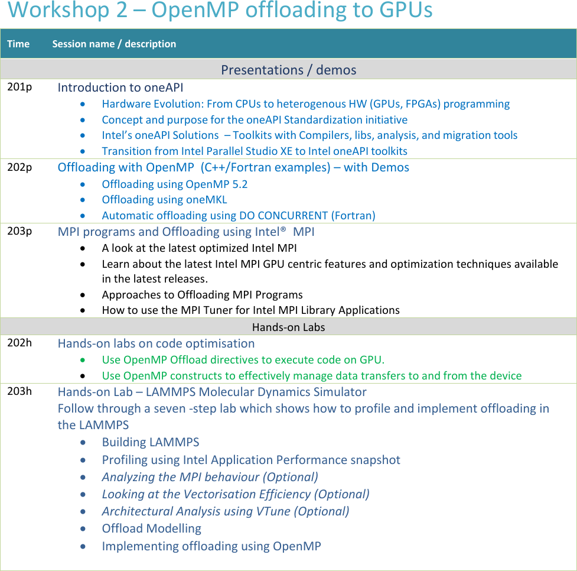

# Programming with oneAPI

The contents of the workshop are as follows:

## Tentative Date

The workshop is scheduled for 23rd September, 2024.

## Number of Participants

We can accommodate from 25 to 30 participants in this workshop.

## Style of the Workshop

We are initially planning to conduct this workshop in-person. However, depending on the number of participants, we may host it online as well. We will update this section soon.

## Venue

We will update the details soon.

## How to Register

We will update the details soon.
