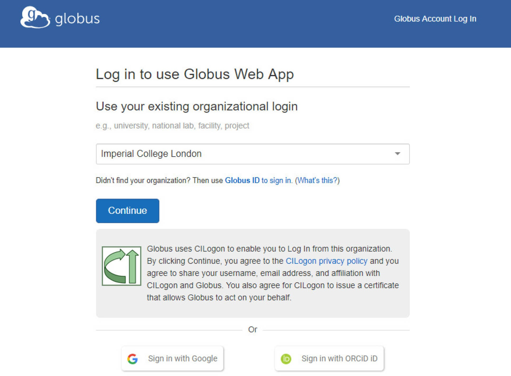
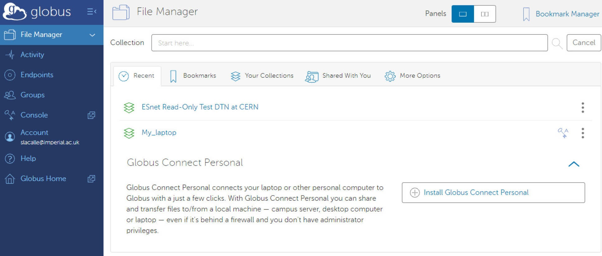
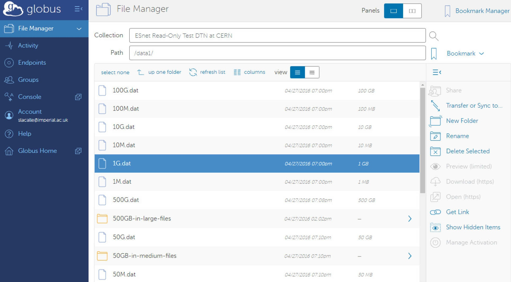
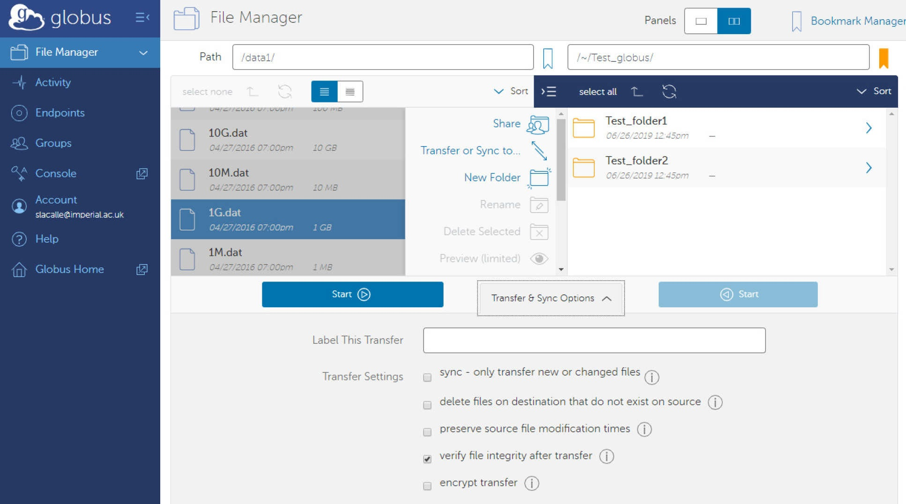

# Globus

## What is Globus

[Globus](https://www.globus.org/) is a high performance data transfer platform.

To support secure and efficient data movement, RCS provides Globus data transfer endpoints across all core services. These enable users to transfer data seamlessly between Imperial systems and external Globus-enabled storage locations.

Using Globus, you can:

* Transfer large volumes of data between the RDS, your personal computer, and Globus-accessible storage at other institutions.
* Share data with external collaborators, without requiring them to have an Imperial account (a Globus identity is required).

## Which services have Globus Endpoints

Globus endpoints are currently available for the following RCS facilities. The corresponding collection names are listed below.

* [Research Data Store (RDS)](../rds/index.md): *Imperial College London Research Data Store*
* [RDF-Active](../rdfactive/index.md): *Imperial College London Research Data Facility Collection*

Globus endpoints are being actively worked on for [HX2](../hpc/hx2/index.md) and will be available soon.

## Logging in to Globus

Step 1: Log in to Globus

Visit [https://app.globus.org](https://app.globus.org), please select **Imperial College London** from the trusted organisations in the drop down list:



The first time you log in you will be asked to complete the registration for a Globus account.

If you have a username and password for any of the institutions you wish to transfer data with, repeat this process to [associate these other identities](https://app.globus.org/account/identities). You can also do this at any later time via "Link another identity" in the web application's Account settings.

Once logged in, you will see the Globus web application File Manager:



From here you will be able to browse your files and folders in the different **collections**. An endpoint is a location where data resides and it can hold several collections. For example, the RDF-Active collection is called **Imperial College London Research Data Facility Collection**. A full list of collections provided by the RCS can be found in the section [above](#which-services-have-globus-endpoints).

## Transferring Data

Step 1: Under [File Manager](https://app.globus.org/file-manager), in the collection field, search for a specific endpoint - The RDF-Active endpoint is called **Imperial College London Research Data Facility Collection**.

Step 2: Once you select the collection you can choose the files/folders you wish to transfer and on the right pane select "**Transfer or Sync to...**"



Step 3: This will open a second panel for the destination. Repeat the process to select a destination endpoint and folder.

Step 4: Optionally choose additional options for the transfer in the tab at the bottom. By default file integrity of transferred files will be checked after the copy is complete. All transfers to the RDS will be encrypted in transit.



Step 5: To commence the transfer, click "**Start**" A new transfer request will be created. Details on the transfer and progress can be monitored in the **Activity** tab.

Step 6: You will receive an email notification once the transfer has completed.

## Sharing Data

The information below is adapted from [https://docs.globus.org/how-to/share-files/](https://docs.globus.org/how-to/share-files/)

If you are the owner or delegated administrator of an RDS project allocation or RDF-Active allocation, you have the ability to selectively share data from your allocations with anyone with a Globus account, without requiring them to have an Imperial College account. 

## Creating a Guest Collection

1. Head to [https://app.globus.org/file-manager](https://app.globus.org/file-manager) and make sure to login with your Imperial credentials.
1. In the "Collection" section at the top, search for the collection you wish to share the data from.
1. Select the directory you want to share and press "Share" in the middle section.
1. There will be an option to "Add Guest Collection", choose that and select/modify any options as you see fit, then press "Create Collection".
1. You should then see an option to "Add Permissions - Share With", select that and you should then see the following options:

* **Path** the folder from which to start the sharing. This is relative to the base directory you specified earlier. The default is "/" - sharing everything in the base directory and below
* **Username or email** the person you wish to share with. This should be an institutional ID that the person can log in to Globus with.
* **Permissions** you may grant write access for the user. Note if you can't grant write access to files or folders that you yourself can't write.

6. You should then have a shareable link which you can send to the user you want to share the data with. The user should also be emailed with the link automatically.

If you are making several collections, you may find it convenient to create [Groups](https://app.globus.org/groups).

## Transfer data to your Personal Computer using Globus

For transferring data to your own computer, or another resource that doesn't have its own Globus endpoint, you will need to install [Globus Connect Personal](https://www.globus.org/globus-connect-personal). This creates a Globus endpoint on your personal computer, allowing you to move data using the Globus web app.

## Using Globus from the Command Line

Globus offers a standalone command-line tool, the **Globus CLI**, which can be used to initiate and manage data transfers directly from the command line.

Further information about the Globus CLI, including installation instructions and usage guidance, is available in the Globus documentation: [https://docs.globus.org/cli/](https://docs.globus.org/cli/).

## Find the UUID of a Collection

Every collection in Globus has a UUID or Universally Unique Identifier; this UUID can be useful in a number of ways including initiating transfers from the command line using the [Globus CLI](#using-globus-from-the-command-line). The UUID is typically of the form:

```
xxxxxxxx-xxxx-xxxx-xxxx-xxxxxxxxxxxx
```

There are a couple of easy ways of finding the UUID of a collection.

### From the Collection page URL

1. Open the Globus File Manager or the specific Collection page.
1. Click into the collection you want.
1. Look at the browser URL.

The url will look something like:

```
https://app.globus.org/file-manager?origin_id=xxxxxxxx-xxxx-xxxx-xxxx-xxxxxxxxxxxx&origin_path=%2F&two_pane=false
```

The text after the *origin_id=* is the UUID of the collection.

### From the Collection details panel

1. Open the collection from the Globus web interface.
1. In the list of collections, you should see three vertical dots next to each collection; click the three vertical dots to view the collection overview.
1. In the overview page that appears, scroll down to the UUID list.