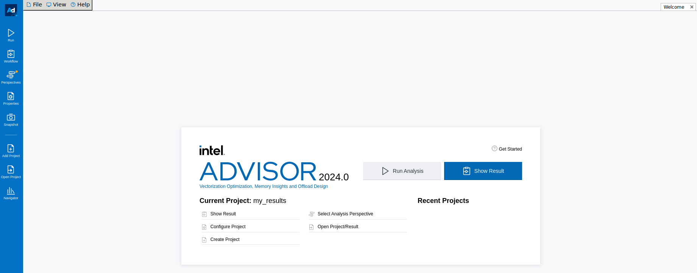
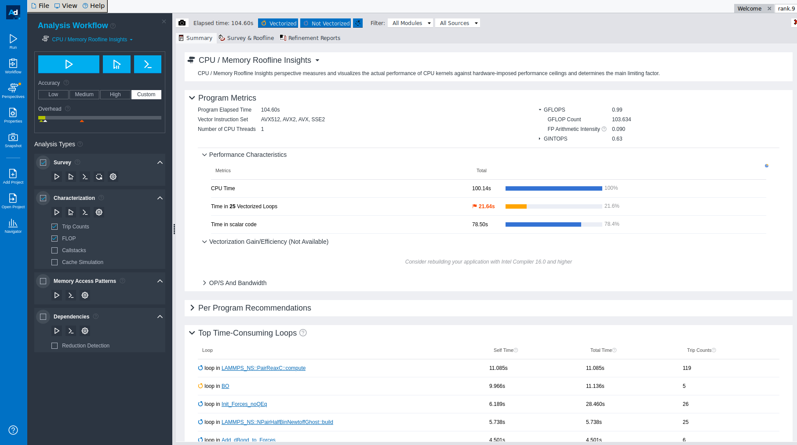
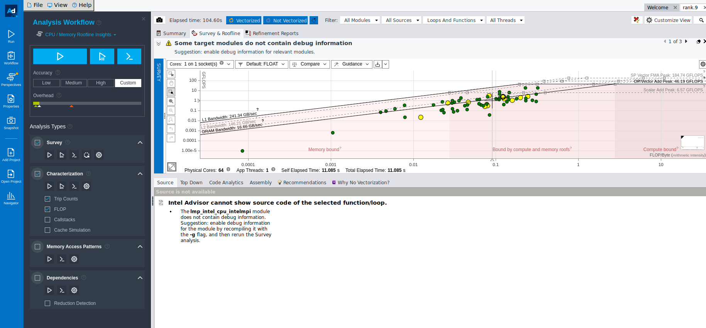

# Intel Advisor

!!! info

    This page has not yet been rewritten for CX3 Phase 2.

Intel Advisor provides following tools to help ensure your Fortran, C, and C++ applications realize full performance potential on modern processors ([https://www.intel.com/content/www/us/en/developer/tools/oneapi/advisor.html#gs.1n6x99](https://www.intel.com/content/www/us/en/developer/tools/oneapi/advisor.html#gs.1n6x99)).

* **Roofline Analysis**:- Tool to help identify whether various functions in your code are memory bound or compute bound. This can help you to identify if you are utilising the full potential of the available hardware or not. This can also be the starting point  to figure out if you have to change your algorithm to make it compute bound. For more details on roofline anlaysis, you can read a very good paper [https://people.eecs.berkeley.edu/~kubitron/cs252/handouts/papers/RooflineVyNoYellow.pdf](https://people.eecs.berkeley.edu/~kubitron/cs252/handouts/papers/RooflineVyNoYellow.pdf) or you can read an easier introduction [https://www.telesens.co/2018/07/26/understanding-roofline-charts/](https://www.telesens.co/2018/07/26/understanding-roofline-charts/).
* **Threading Advisor**: Threading design and prototyping tool to analyze, design, tune, and check threading design options without disrupting a regular environment.
* **Vectorization Advisor**: Optimization tool to identify loops that will benefit most from vectorization, analyze what is blocking effective vectorization, and forecast the benefit of alternative data reorganizations.

We will be describing how to create roofline charts using Intel Advisor in this page while the other options are left for user to explore.

## Example Script to generate roofline charts

If an application has an MPI component in it, we need two steps to generate a roofline chart. Both these two steps are given in the following script. Since the exact details of what happens in these two steps are not clear to us, we just mention how to use them below.

```bash
#PBS -l walltime=00:20:00
#PBS -l select=2:ncpus=64:mem=200gb:mpiprocs=64:ompthreads=2
#PBS -N pinning_t2_c2_intelmpi
#PBS -o out.txt
#PBS -e error.txt
 
# Load the modules
module load imkl-FFTW/2023.1.0-iimpi-2023a
module load VTune/2022.3.0
 
# Load the separate advisor module
module load Advisor/2023.2.0
 
# Print pinning options
export I_MPI_DEBUG=5
export OMP_NUM_THREADS=2
export KMP_AFFINITY=verbose
 
cd $PBS_O_WORKDIR
 
# Your job specific command goes here.
lammps_path="/gpfs/home/lragta/RCS_help/1_janet/lkr/src/lmp_intel_cpu_intelmpi"
 
 
temp1=900
ex=0.0
ey=0.0
ez=0.0
 
 
# The first of two steps as described above for mpi applications.
# Collect the survey
mpirun -gtool "advisor --collect=survey --project-dir=./my_results:0-63" -v6 -np 64 ${lammps_path} -l log.lammps -nocite -var temp1 ${temp1} -var ex ${ex} -var ey ${ey} -var ez ${ez} -in alkyl-amor-nvt.in
 
# The second step Runs trip counts
mpirun -gtool "advisor --collect=tripcounts --flop --project-dir=./my_results:0-63" -v6 -np 64 ${lammps_path} -l log.lammps -nocite -var temp1 ${temp1} -var ex ${ex} -var ey ${ey} -var ez ${ez} -in alkyl-amor-nvt.in
```

where

`--project_dir =` This is a user specified directory and is the location where the results will be saved (mandatory to give)

the numbers 0:63 in `--project-dir=./my_results:0-63` specify the mpi ranks which will be used to collect the results. In this case, we are collecting results from all the ranks.

!!! warning

    Please note that the application runs twice because of the above steps and it may take some extra time to generate results. Ask for a good enough amount of time initially.

### Sample results
To see the results, login to the cluster with X forwarding. Use the command below

```console
ssh -X username@hostname
```

This is because we will be opening a GUI for viewing the results and X flag allows us to do that.

Make sure that the Intel Advisor module is loaded as mentioned in the above sample script. To open the GUI, type the following command

```
advisor-gui
```

This will open the following GUI:-



Use the show result option and point to the directory where the results have been saved (the argument of `--project-dir` as described above).

Once you open the results, you will see a summary of results as shown below.



Click on the survey and roofline to get the roofline charts for your application. A typical roofline chart will look like the following:-



This concludes our introduction on how to use Intel Advisor for your applications. We hope that you will find it easy to use after these instructions and will use it for developing your HPC applications.

