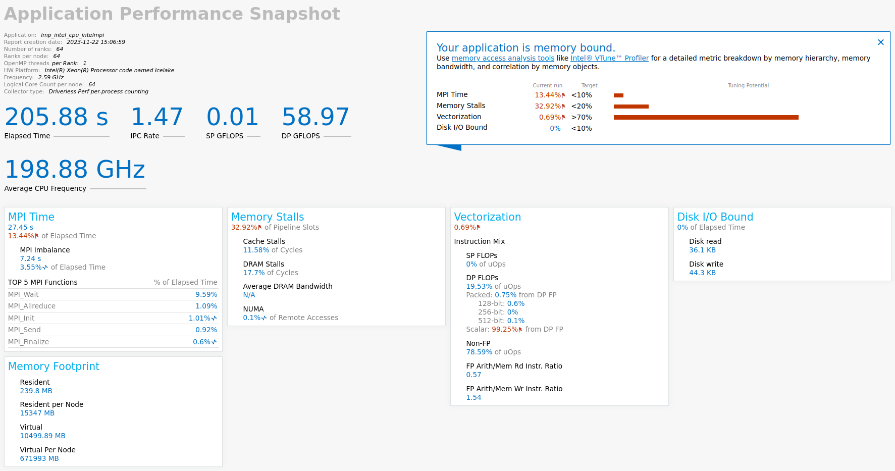
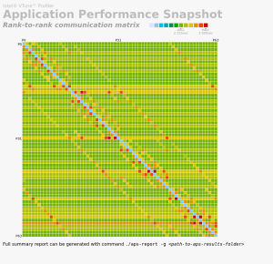

# Intel Application Performance Snapshot (APS)

Intel VTune Profiler Application Performance Snapshot (APS) allows you to have a quick view into different aspects of compute intensive applications' performance, such as MPI and OpenMP usage, CPU utilization, memory access efficiency, vectorization, I/O, and memory footprint. Application Performance Snapshot displays key optimization areas and suggests specialized tools for tuning particular performance aspects, such as Intel VTune Profiler and Intel Advisor. The tool is designed to be used on large MPI workloads and can help analyze different scalability issues.


To use APS tool, you do not need to recompile your application with  the debug (`-g`) flag.  Depending on whether your application is only OpenMP or MPI, the process differs in only one line. For hybrid applications (MPI + OpenMP), you can use the same steps as outlined in the MPI section.


To use APS on HX1, you can load the appropriate module by

```console
module load VTune/2022.3.0
```

## Analyse an OpenMP application using APS

Analysing an OpenMP application through Aps consists of 2 steps:-

**Step 1.** Run analysis by

```console
aps <aps_parameters> <your_app> <your_application_parameters>
```

where `<your_app>` is the application that you want to analyse.

**Step 2.** After Step 1 completes, it will generate a report (similar to name aps_report_date.html) which you can copy to your local computer and view it in your browser.

## Analyse an MPI application using APS

Analysing an MPI application through Aps consists of the following 3 steps:-

**Step 1.** Run the following command to analyse your MPI application.

```
<mpi_launcher> <mpi_parameters> aps <aps_parameters> <your_app> <your_application_parameters>
```

where `<mpi_launcher>` is the MPI launcher such as mpirun, srun, apirun etc.

**Step 2.** After Step 1 completes, it will generate a directory with a name  similar to aps_report_date. You will have to use this directory to generate the report. Use the following command to generate the report.

```
aps --report=aps_result_<date>
```

**Step 3.** After step 2, you will get an HTML report which you can copy to your computer and use a browser to view the same.

## Sample script and sample result
The following code block gives a sample script that we used for an hybrid MPI + OpenMP application. Please modify the script accordingly to suit your needs.

```bash
#PBS -l walltime=00:05:00
#PBS -l select=2:ncpus=64:mem=200gb:mpiprocs=64:ompthreads=2
#PBS -N pinning_t2_c2_intelmpi
#PBS -o out.txt
#PBS -e error.txt
 
# Load the modules
module load imkl-FFTW/2023.1.0-iimpi-2023a
module load VTune/2022.3.0
 
# some pinning option
export I_MPI_DEBUG=5
export OMP_NUM_THREADS=2
export KMP_AFFINITY=verbose
 
cd $PBS_O_WORKDIR
 
#your app specific
lammps_path="/gpfs/home/lragta/RCS_help/1_janet/lkr/src/lmp_intel_cpu_intelmpi"
 
temp1=900
ex=0.0
ey=0.0
ez=0.0
 
# This will generata the aps result folder.
mpirun -v6 -np 64 aps --stat-level=5  ${lammps_path} -l log.lammps -nocite -var temp1 ${temp1} -var ex ${ex} -var ey ${ey} -var ez ${ez} -in alkyl-amor-nvt.in
```

You can submit this as a job script to the  scheduler to run on the compute nodes. In my case, it generated a folder called aps_result_20231122. We then used the following command to generate the report (you can submit this too on the  compute nodes if the report generation takes too much time for you).

```
# Generate the report based on the folder.
aps --report aps_result_20231122
```

With this command, we get an HTML file that looks like the following (when viewed in the browser).



If you are interested to see a graphic representation of  rank-to-rank communication, you can use the following command

```console
# Generate rank to rank html report. Optional and may be useful in some cases.
aps-report -x --format=html aps_result_20231122/
```

This command will generate the following interactive type of representation (when viewed in browser).



With this, we conclude this basic tutorial on APS and we hope that you should be able to use the same for your application.