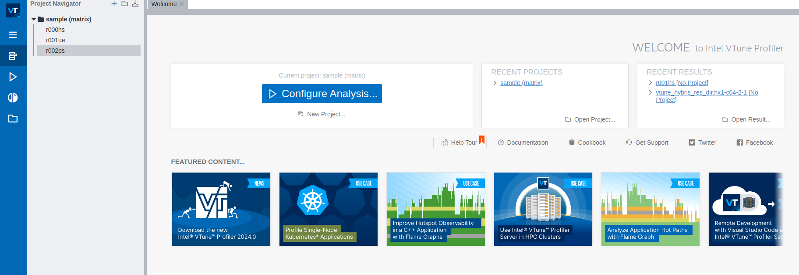
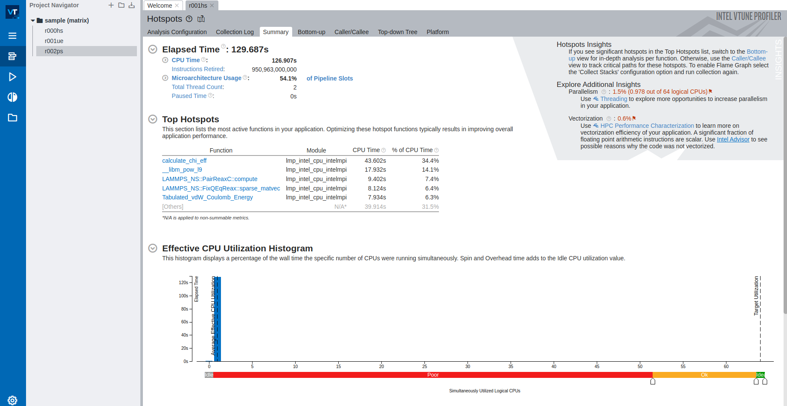

# Intel Vtune Profiler

Intel Vtune Profiler provides a deep insight into a node-level performance including algorithmic hotspot analysis, OpenMP threading, general exploration microarchitecture analysis, memory access efficiency, and more. It supports languages such as C/C++, Fortran, Java, Python etc.

To use Vtune on HX1, you would need to load the module by

```console
module load VTune/2022.3.0
```

The general syntax to use Vtune for your application is

```console
vtune -collect analysis_type <vtune specific options> -- <your_app> <your_app_parameters>
```

where,  analysis_type can be one of the options such as

1. hotspots
1. threading
1. memory-consumption
1. hpc-performance

For a full list of commands, please see [https://www.intel.com/content/www/us/en/docs/vtune-profiler/user-guide/2023-0/collect.html](https://www.intel.com/content/www/us/en/docs/vtune-profiler/user-guide/2023-0/collect.html).

If you are not sure of a particular command and need help, you can type in the terminal 

```console
vtune -help collect
#or more specificvtune -help collect <analysis_type>
```

There are 3 steps in general that you may have to perform to analyse and visualise your results.

1. Run the analysis.
1. Generate the report.
1. View the results.

We tell the each step in detail (and an example script where required).

## Run the analysis

As mentioned above, this is the first step in the analysis and involves using the command `vtune -collect` described above. Below we give an example script that you can use in your applications to perform the analysis on the compute node.

```bash
#PBS -l walltime=00:05:00
#PBS -l select=1:ncpus=64:mem=200gb
#PBS -N pinning_t2_c2_intelmpi
#PBS -o out.txt
#PBS -e error.txt
 
# Load the modules
module load imkl-FFTW/2023.1.0-iimpi-2023a
module load VTune/2022.3.0
 
# some pinning option (this will print some information in the output file about where the threads and processes were launched).
export I_MPI_DEBUG=5
export OMP_NUM_THREADS=64
export KMP_AFFINITY=verbose
 
cd $PBS_O_WORKDIR
 
# your job specific commands goes here.
lammps_path="/gpfs/home/lragta/RCS_help/1_janet/lkr/src/lmp_intel_cpu_intelmpi"
 
temp1=900
ex=0.0
ey=0.0
ez=0.0
 
# Vtune command goes here.
vtune -collect hotspots -knob sampling-mode=hw ${lammps_path} -l log.lammps -nocite -var temp1 ${temp1} -var ex ${ex} -var ey ${ey} -var ez ${ez} -in alkyl-amor-nvt.in
```

## Generate the report
Once the above analysis is complete, you will see a results directory that would have been generated for you by the vtune. In our case, it was r001hs. The next step is to use this directory to generate a report. You can create another job script for the same (requiring far less resources than the analysis step. Typically one core for a few minutes is all that you need to generate the report). You would typically need to replace the resources and the last vtune command with the following.

```console
vtune -R hotspots -result-dir r001hs/
```

There are multiple options that can be used with the `-R` flag also by full name as `-report` flag. For more details, please see [https://www.intel.com/content/www/us/en/docs/vtune-profiler/user-guide/2023-0/report.html](https://www.intel.com/content/www/us/en/docs/vtune-profiler/user-guide/2023-0/report.htmls). For example you can use command like

```console
vtune -R gprof-cc -result-dir r001hs/vtune -R summary -result-dir r001hs/
```

to generate a call tree with time (gprof-cc) or summary of the results (summary).

## View the results

Once you have completed the above two steps, it is now time to visualise the results using the GUI. For this we suggest you to open another terminal and login with -X forwarding. For example your login command will look like

```console
ssh -X username@hostname
```

Load the appropriate modules and launch the Vtune GUI with

```
vtune-gui
```
This should open up a GUI window as shown below



On the extreme left, you would see a open result option (folder icon in the left window pane). Click on that and open the result that you want to visualise. On opening the result at our end, we see the following. 

!!! note

    Please do not pay attention to the results below. They are for demonstration only. We believe that we had some issues with the application that we were testing and this is why the CPU utilisation is quite low.



This concludes our introductory demonstration on how to use Intel Vtune profiler. We hope that you may find it useful and easy and you would be able to use this in your own applications.
