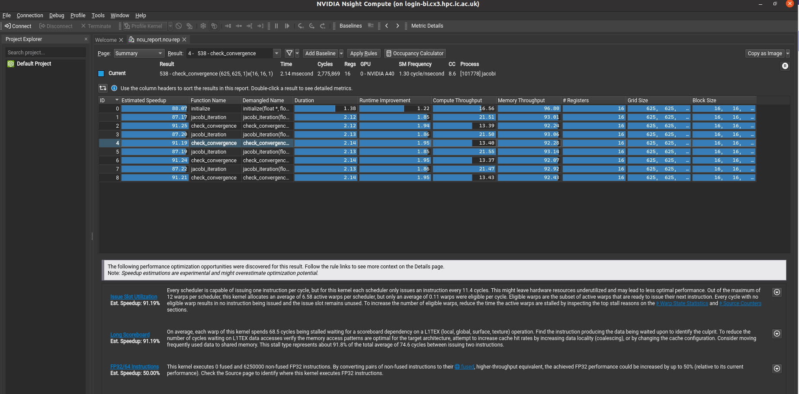

# Nsight Compute

[Nvidia Nsight Compute](https://developer.nvidia.com/nsight-compute) is an interactive kernel profiler for Cuda applications. Once you are satisfied with how your code is interacting with Cpu using [Nsight Systems](./nsight_systems.md), you can now turn to go deeper to see how your kernels are actually using the Gpu.

We suggest that you login using the X11 forwarding enabled. To profile the code with Nsight Compute, you can use the following steps.

```bash
# Login to the system with the X11 forwarding enabled.
ssh -X username@hostname

# Load the appropriate cuda module. We recommend using new versions as older versions are not supported on our systems for profiling.
module load tools/prod
module load CUDA/12.2.0

# Load the Qt module. This is because Nsight Compute uses Qt for its GUI.
module load Qt5/5.15.5-GCCcore-11.3.0

# If you want to see the source code in your profile, use the following lineinfo flag to compile your jacobi code.
nvcc -lineinfo jacobi.cu -o jacobi
```

Finally, to profile the code, you can use the following command
```bash
ncu --set full -f -o ncu_report <your_app> <your_app_parameters>

#For the above jacobi example, you can use the following command.
ncu --set full -f -o ncu_report ./jacobi
```

where, `-f` is for force overwrite and will overwrite the output file it already exists.
`-o` is the name of the file in which Nsight Compute will save the profiling data.
`--set full` is to set the profiler to capture all the information.

To view the profiling data, you can use the following command.

```bash
ncu-ui
```

This will open a GUI and you should be able to use it to view the profiling data as shown below.



Click on the page button to see details such as session, sumamry, source etc.