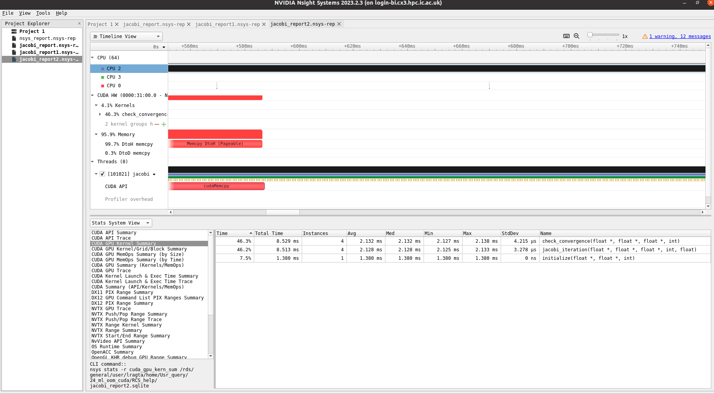

# Nsight Systems

[NVIDIA Nsight Systems](https://developer.nvidia.com/nsight-systems) is a system-wide performance analysis tool designed to visualize an application’s algorithms, identify the largest opportunities to optimize, and tune to scale efficiently across any quantity or size of CPUs and GPUs, from large servers to our smallest systems-on-a-chip (SoCs).

## Profile the code using nsight systems

You can profile the code interactively or via a batch job.

1. The first step is to load the appropriate modules.

```bash
module load tools/prod

# Load the appropriate CUDA module. We recommend using new versions as older versions are not supported on our systems for profiling. On CX3 phase 2, use CUDA versions >= 12.2.0.
module load CUDA/12.2.0

# Load a Qt module. This is because Nsight Systems uses Qt for its GUI. 
module load Qt5/5.15.5-GCCcore-11.3.0
```

2. To profile the code either interactively on the login node or via a batch job, you can use the following command.

```bash
nsys profile --trace cuda,osrt,nvtx --force-overwrite true --output <output_file> <your_app> <your_app_parameters>
```

where,
`output_file` is the name of the file in which nsight systems will save the profiling data.
`your_app` is the name of the executable of your application.
`your_app_parameters` are the parameters that you pass to your application.

Please note that `force-overwrite` will overwrite the output file if it already exists. If you want to keep the old data, you can remove this option.

For example, to profile a simple CUDA Jacobi (C++) program, you can use the following command.

```bash
nsys profile --trace cuda,osrt,nvtx --force-overwrite true --output jacobi_profile ./jacobi
```

For Python applications, you can use the following command.

```bash
nsys profile --trace cuda,osrt,nvtx --force-overwrite true --output python_profile python3 my_sctipt.py
```

## Viewing the profiling data

There are two ways by which you can view the profiling data.

1. On your local machine.
2. On the HPC system itself.

To view the profiling data on the local machine, copy the output file to your local machine, install the Nsight Systems GUI, and open the file in the GUI.

To view the profiling data on the HPC system, do the following.

```bash
# First login to the system with the X11 forwarding enabled. You should be able to use the same terminal if you already used X flag while logging in. If not, you can open a new terminal and login with the X flag.
ssh -X username@hostname

# Load the above modules.
# Open the nsight systems GUI by

nsys-ui
```
This will open up a GUI as shown below. Open the file you just created and you  would see something like the image shown below.

