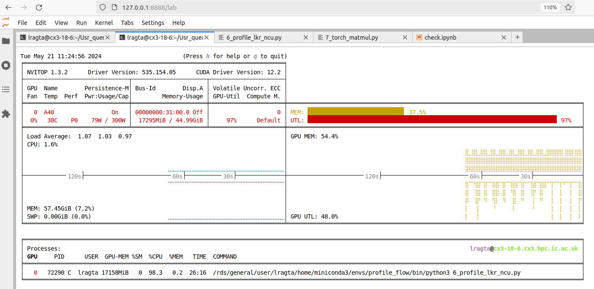

# nvitop

!!! info

    This page has not yet been rewritten for CX3 Phase 2.

[nvitop](https://nvitop.readthedocs.io/en/latest/index.html) is an interactive, easy to use command-line tool that provides a real-time view of the GPU utilization on a node. It helps to monitor the GPU usage and its memory consumption on a node.

The output is graphical in nature as shown below which makes it easy to understand and interpret.



There are two ways by which you can use this tool on your interactive session:

1. By installing it in your own environment.
2. Using pre-installed version on the HPC system.

## Installing nvitop in your own environment

One of the easist way to install nvitop is to use conda. The following command assumes that you have conda in your environment and you know how to use it. For more details see [conda guide](../../applications/guides/conda.md).

```bash
# Install nvitop in the currently activated environment.
# If you did not activate any environment, it will be installed in the base environment (not recommended).
conda install -c conda-forge nvitop

# To use the tool, use the following command
nvitop
```

You will see the above graphical output on your terminal.

## Using pre-installed version on the HPC system

We have already installed nvitop on the HPC system. To use it, you need to load the module by

```bash
module load tools/prod
module load nvitop/1.3.2-GCCcore-12.3.0-CUDA-12.3.0

# To use the tool, use the following command
nvitop
```

!!! note

    We have observed some issues in graphics display when using this module. We are trying to fix it. In the meantime, you can use the tool in your own environment as described above.
