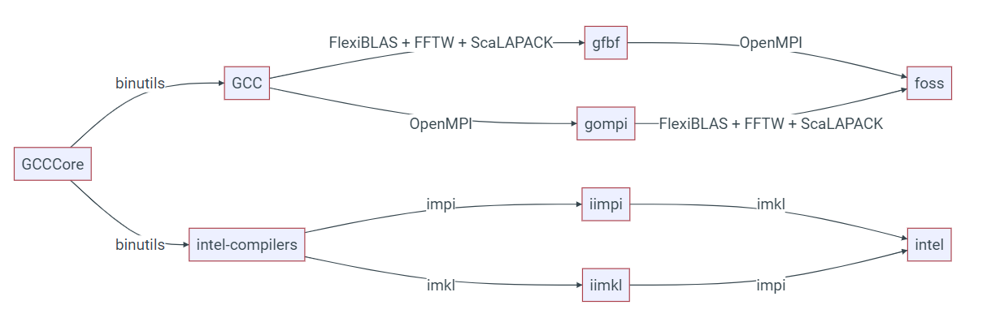

# EasyBuild

!!! info

    This page has been rewritten for CX3 Phase 2.

We use the [EasyBuild](https://easybuild.io) software installation system to manage the central installation of most user software requests. EasyBuild enables us to provide software that is optimised for the HPC hardware, as well as respond to requests more timely than if we installed the software manually.

You do **not** need to understand how EasyBuild works to load and use the applications we've installed using it. Please see the [Loading Applications](./index.md) page for assistance with finding and loading installed applications.

The following sections cover more details of how EasyBuild is used on the Imperial HPC service for those who are interested or require further information.

## Understanding the EasyBuild module naming - toolchains

When listing the available modules on the system, you may notice that aside from the application name and version, the module name includes some extra information; this extra information refers to the "toolchain" used to build (or compile) the software from the source code, which we do so to ensure the application gets the best performance from the hardware.

EasyBuild uses the concept of ["compiler" toolchains](https://docs.easybuild.io/terminology/#toolchains) to refer to the set of software that was used to compile the application. These named and versioned tool chains (such as "*foss-2024b*" or "*intel-2023b*") will include one or more compilers, maths libraries providing optimised routines for common maths operations, and an MPI distribution (MPI or Message Passing Interface is used by programs to communicate between multiple compute nodes). There are also a number of "sub-toolchains" for programs that don't, for example, don't require MPI support. The following diagram demonstrates how these toolchains fit together:



On the Imperial HPC systems you will typically find applications compiled with either the *foss* (based on the GCC compiler) or the *intel* (based on the Intel compiler) toolchains. Details on these toolchains (including version numbers of the tools) may be found on the [EasyBuild Common Toolchains](https://docs.easybuild.io/common-toolchains/#common_toolchains_overview) page. We generally recommend you avoid trying to load applications for different toolchains as this can result in problems when running your applications.

### Deciphering an example module name

[GROMACS](https://www.gromacs.org/) is a molecular dynamics program commonly used on HPC facilities. As per the advice on the [Loading Applications](./index.md) page, a list of all modules providing GROMACS may be found by using the `module avail` command:

```console
[user@login ~]$ module avail GROMACS

-------------------------------- /sw-eb/modules/all ---------------------------------
   GROMACS/2021.3-foss-2021a-CUDA-11.3.1
   GROMACS/2021.3-foss-2021a-PLUMED-2.7.2
   GROMACS/2021.3-foss-2021a
   GROMACS/2021.5-foss-2021b-PLUMED-2.8.0
   GROMACS/2021.5-foss-2021b
   GROMACS/2023.1-foss-2022a-CUDA-11.7.0
   GROMACS/2023.1-foss-2022a
   GROMACS/2023.3-foss-2023a
   GROMACS/2024.1-foss-2023b              (D)

  Where:
   D:  Default Module
```

Using the example of `GROMACS/2024.1-foss-2023b`, you can see that the module name includes the name of the application `GROMACS` followed by the suffix `GROMACS/2024.1-foss-2023b`. The first part of the suffix `2024.1` is the version of GROMACS this is referring to. The second part of the suffix, `foss-2023b` is the EasyBuild compiler toolchain used to build that version of GROMACS.

The compiler toolchains also have their own corresponding module and in the case of `foss-2023b` this would be `foss/2023b`. You can then use the `module show` command with this module name to see what tools were used to build the application. For example:

```console
[dwitheri@login-bi ~]$ module show foss/2023b
----------------------------------------------------------------------------------
   /sw-eb/modules/all/foss/2023b.lua:
----------------------------------------------------------------------------------
help([[
Description
===========
GNU Compiler Collection (GCC) based compiler toolchain, including
 OpenMPI for MPI support, OpenBLAS (BLAS and LAPACK support), FFTW and ScaLAPACK.


More information
================
 - Homepage: https://easybuild.readthedocs.io/en/master/Common-toolchains.html#foss-to
olchain
]])
whatis("Description: GNU Compiler Collection (GCC) based compiler toolchain, including
 OpenMPI for MPI support, OpenBLAS (BLAS and LAPACK support), FFTW and ScaLAPACK.")
whatis("Homepage: https://easybuild.readthedocs.io/en/master/Common-toolchains.html#fo
ss-toolchain")
whatis("URL: https://easybuild.readthedocs.io/en/master/Common-toolchains.html#foss-to
olchain")
conflict("foss")
load("GCC/13.2.0")
load("OpenMPI/4.1.6-GCC-13.2.0")
load("FlexiBLAS/3.3.1-GCC-13.2.0")
load("FFTW/3.3.10-GCC-13.2.0")
load("FFTW.MPI/3.3.10-gompi-2023b")
load("ScaLAPACK/2.2.0-gompi-2023b-fb")
setenv("EBROOTFOSS","/sw-eb/software/foss/2023b")
setenv("EBVERSIONFOSS","2023b")
setenv("EBDEVELFOSS","/sw-eb/software/foss/2023b/easybuild/foss-2023b-easybuild-devel"
)
```

The load commands at the end of output show that the following tools were used to build this version of GROMACS:

* GCC 13.2.0
* OpenMPI 4.1.6
* FlexiBLAS/3.3.1
* FFTW 3.3.10
* ScaLAPACK/2.2.0

## Accessing CUDA or GPU accelerated software

If an application is CUDA/GPU accelerated, EasyBuild includes CUDA in the module name. You can see a list of all modules/applications installed with CUDA support by running:

```console
[user@login ~]$ module avail CUDA
---------------------------- /sw-eb/modules/all ----------------------------
   AlphaFold/2.3.1-foss-2022a-CUDA-11.8.0
   AlphaPulldown/2.0.0b4-foss-2022a-CUDA-11.8.0
   CUDA/11.4.1
   CUDA/11.5.2
   CUDA/11.7.0
   CUDA/11.8.0
   CUDA/12.0.0
   CUDA/12.1.1
   CUDA/12.2.0
   CUDA/12.2.2
   CUDA/12.3.0
   CUDA/12.3.2
   CUDA/12.4.0
   CUDA/12.5.0
   CUDA/12.6.0                                    (D)
   CuPy/13.0.0-foss-2023a-CUDA-12.1.1
   GROMACS/2021.3-foss-2021a-CUDA-11.3.1
   GROMACS/2023.1-foss-2022a-CUDA-11.7.0
   HOOMD-blue/4.0.1-foss-2022a-CUDA-11.7.0
   NCCL/2.10.3-GCCcore-10.3.0-CUDA-11.3.1
   NCCL/2.10.3-GCCcore-11.2.0-CUDA-11.5.2
   NCCL/2.12.12-GCCcore-11.3.0-CUDA-11.7.0
--More--
```

You can then load one of these modules and it will automatically load any dependencies including CUDA itself.

```console
[user@login ~]$ module load GROMACS/2023.1-foss-2022a-CUDA-11.7.0
[user@login ~]$ module list

Currently Loaded Modules:
  1) tools/prod                        21) gompi/2022a
  2) GCCcore/11.3.0                    22) FFTW.MPI/3.3.10-gompi-2022a
  3) zlib/1.2.12-GCCcore-11.3.0        23) ScaLAPACK/2.2.0-gompi-2022a-fb
  4) binutils/2.38-GCCcore-11.3.0      24) foss/2022a
  5) GCC/11.3.0                        25) CUDA/11.7.0
  6) numactl/2.0.14-GCCcore-11.3.0     26) GDRCopy/2.3-GCCcore-11.3.0
  7) XZ/5.2.5-GCCcore-11.3.0           27) UCX-CUDA/1.12.1-GCCcore-11.3.0-CUDA-11.7.0
  8) libxml2/2.9.13-GCCcore-11.3.0     28) bzip2/1.0.8-GCCcore-11.3.0
  9) libpciaccess/0.16-GCCcore-11.3.0  29) ncurses/6.3-GCCcore-11.3.0
 10) hwloc/2.7.1-GCCcore-11.3.0        30) libreadline/8.1.2-GCCcore-11.3.0
 11) OpenSSL/1.1                       31) Tcl/8.6.12-GCCcore-11.3.0
 12) libevent/2.1.12-GCCcore-11.3.0    32) SQLite/3.38.3-GCCcore-11.3.0
 13) UCX/1.12.1-GCCcore-11.3.0         33) GMP/6.2.1-GCCcore-11.3.0
 14) libfabric/1.15.1-GCCcore-11.3.0   34) libffi/3.4.2-GCCcore-11.3.0
 15) PMIx/4.1.2-GCCcore-11.3.0         35) Python/3.10.4-GCCcore-11.3.0
 16) UCC/1.0.0-GCCcore-11.3.0          36) pybind11/2.9.2-GCCcore-11.3.0
 17) OpenMPI/4.1.4-GCC-11.3.0          37) SciPy-bundle/2022.05-foss-2022a
 18) OpenBLAS/0.3.20-GCC-11.3.0        38) networkx/2.8.4-foss-2022a
 19) FlexiBLAS/3.2.0-GCC-11.3.0        39) GROMACS/2023.1-foss-2022a-CUDA-11.7.0
 20) FFTW/3.3.10-GCC-11.3.0
```

## Accessing the development software stack

When you log in, by default you will have access to our "*production*" modules; these are modules that have been installed and tested by the wider EasyBuild community. You can tell if you are using the production modules using the `module list` command:

```console
[user@login ~]$ module list

Currently Loaded Modules:
  1) tools/prod
```

Occassionally you may be asked by the RCS team to load a module from the "*development*" software stack; this is software which has been built and tested by Imperial using EasyBuild, but that has not been tested by the wider EasyBuild community. To access these modules, you would need to unload or purge the production module set and then load the development modules, for example:

```console
[user@login ~]$ module purge
[user@login ~]$ module load tools/dev
[user@login ~]$ module list

Currently Loaded Modules:
  1) tools/dev
```

## Advanced Topics

### Compiling your own software with EasyBuild toolchains

If you have your own code to compile, or you wish to compile a modified version of a widely used code, you may find it useful to build the application using the EasyBuild toolchains. For this purpose, EasyBuild provides the [buildenv](https://docs.easybuild.io/version-specific/supported-software/b/buildenv/) modules, which not only load tools and libraries corresponding to the toolchain in question, it also sets some helpful environment variables used during compilation and linking such as `OPTFLAGS`.

You can see a list all available *buildenv* modules using the `module avail` command: 

```console
[user@login ~]$ module avail buildenv
 module avail buildenv

---------------------------------- /sw-eb/modules/all ----------------------------------
   buildenv/default-foss-2022a                buildenv/default-foss-2024a
   buildenv/default-foss-2022b-CUDA-12.0.0    buildenv/default-intel-2022a
   buildenv/default-foss-2022b                buildenv/default-intel-2022b
   buildenv/default-foss-2023a-CUDA-12.1.1    buildenv/default-intel-2023a
   buildenv/default-foss-2023a                buildenv/default-intel-2023b
   buildenv/default-foss-2023b                buildenv/default-intel-2024a (D)

  Where:
   D:  Default Module
```

You can use the `module show` command to see what other modules will be loaded, as well as seeing what environment variables are set by the module:

```console
[user@login ~]$ module show buildenv/default-foss-2024a
-------------------------------------------------------------------------------------
   /sw-eb/modules/all/buildenv/default-foss-2024a.lua:
-------------------------------------------------------------------------------------
help([[
Description
===========
This module sets a group of environment variables for compilers, linkers, maths 
libraries, etc., that you can use to easily transition between toolchains when 
building your software. To query the variables being set please use: 
module show <this module name>
#
# output shortened for clarity
#
setenv("CXX","g++")
setenv("CXXFLAGS","-O2 -ftree-vectorize -march=native -fno-math-errno")
setenv("F77","gfortran")
setenv("F90","gfortran")
setenv("F90FLAGS","-O2 -ftree-vectorize -march=native -fno-math-errno")
setenv("FC","gfortran")
setenv("FCFLAGS","-O2 -ftree-vectorize -march=native -fno-math-errno")
setenv("FFLAGS","-O2 -ftree-vectorize -march=native -fno-math-errno")
# etc.
```

You can load the *buildenv* module as you would load any other module, with the `module load` command:

```console
[user@login ~]$ module load buildenv/default-foss-2024a
```

When you come to running the application you have compiled, you will need to load the corresponding toolchain module in your submission script. For example, if you compiled your software using the `buildenv/default-foss-2024a` module, you would need to add the following line to your submission script:

```bash
module load foss/2024a
```

### Using EasyBuild yourself

If you are interested in using EasyBuild yourself, we strongly recommend you review the extensive [EasyBuild documentation](https://docs.easybuild.io/) and [tutorial](https://tutorial.easybuild.io/). If you require help with using EasyBuild on Imperial HPC systems, please [raise a ticket](../../support/index.md) to contact us.

We will also be offering hands-on workshops throughout the year to explain the benefits of using EasyBuild for your software development project for example, or simply how to make the best use of the new and exciting software stack. These workshops will be announced via the [usual channels](https://www.imperial.ac.uk/admin-services/ict/self-service/research-support/rcs/about/newsletter-subscription/).