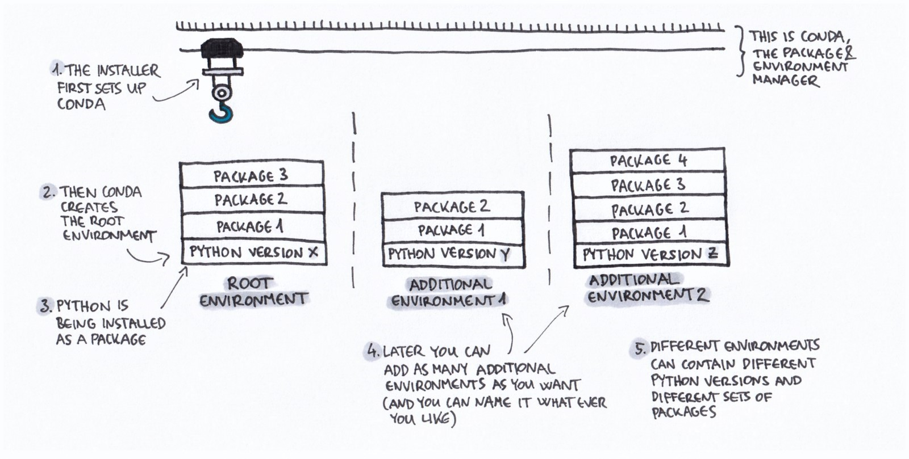

# Conda

[Conda](https://docs.conda.io/en/latest/) is a package, dependency and environment management system that is available via the Anaconda distribution. It is one of the ways for users to manage their own environments and supports a wide range of languages: Python, R, Ruby, Lua, Scala, Java, JavaScript, C/ C++, FORTRAN.

Conda as a package manager helps you find and install packages. If you need a package that requires a different version of Python, you do not need to switch to a different environment manager, because conda is also an environment manager. With just a few commands, you can set up a totally separate environment to run that different version of Python, while continuing to run your usual version of Python in your normal environment.

Using different conda environments for different projects/applications is highly recommended and certainly offers many advantages:

* conda environments integrate management of different Python versions, including installation and updating of Python itself. On comparison, virtualenvs must be created upon an existing, externally managed Python executable.
* conda environments can track non-python dependencies; for example seamlessly managing dependencies and parallel versions of essential tools like LAPACK or OpenSSL
* Rather than environments built on symlinks – which break the isolation of the virtualenv and can be flimsy at times for non-Python dependencies – conda-envs are true isolated environments within a single executable path.



## Using conda
On the login node run:

```console
module load anaconda3/personal
```

If its the first time loading you will need to run:

```
anaconda-setup
```

You only need to run `anaconda-setup` once for your user account but `module load anaconda3/personal` will need to be run everytime you want to use the Anaconda environment (including in jobs).

## Conda Table of Commands

| Conda basic commands | COMMAND |
| -------------------- | ------- |
| Get a list of all my environments, active environment is shown with * | conda env list |
| Create a new environment named py39, install Python 3.9 | conda create -n py39 python=3.9 |
| Activate an environment | source activate ENV_NAME |
| Deactivate an environment | conda deactivate |
| List all packages and versions installed in active environment | conda list |
| Search the Anaconda repository for a package | conda search PACKAGENAME |
| Install a package included in Anaconda | conda install PACKAGENAME |
| Remove unused packages and caches | conda clean |

For a full list of commands please look at the [conda cheet sheet](https://docs.conda.io/projects/conda/en/latest/_downloads/843d9e0198f2a193a3484886fa28163c/conda-cheatsheet.pdf) provided by Anaconda.