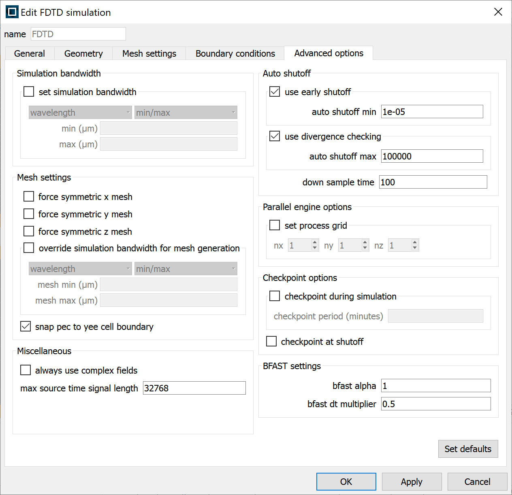

# Lumerical

Lumerical is a suite of tools that can be used to model the optical, electrical and thermal effects of Photonic systems. Below is a general overview of getting started with Lumerical on Imperial HPC. Ansys also provide more detailed information at [https://optics.ansys.com/hc/en-us](https://optics.ansys.com/hc/en-us).

## Licensing

Lumerical is a licensed product and all users will need access to a license from a flexlm server. The **RCS team do not managed these licenses** so users will need to talk to their group/school/department heads to see if a license is available. 

Once a license source has been found the port and address of the flexlm server will need to be set in the license.ini file. Run the following to create the directories and file needed.

```console
mkdir -p ~/.config/Lumerical
nano ~/.config/Lumerical/License.ini
```
Once nano loads enter the following details, replacing <port\> with the port for the flexlm server and <address\> with the address for the flexlm server.

```
[license]
ansysserver\host=<port>@<address>
default=user
domain=3
type=flex
flexserver\host=<port>@<address>
```

To save and exit nano press CTRL+O followed by ENTER then CTRL+X

## Setting up the simulation

Lumerical should only be used on the HPC to run computations in headless mode. Please update/edit simulations on a local machine and then upload them to the RDS/HPC when ready.

## Running a job

All jobs on HPC should be run in headless mode and will need to be submitted to the scheduler. Below is an example job using the MPI version of the fdtd-engine device. Don't worry if this looks complicated, we will go through it line-by-line. Also, Ansys has more general information on running FDTD simulations at [https://optics.ansys.com/hc/en-us/articles/360033154434](https://optics.ansys.com/hc/en-us/articles/360033154434)

```bash
#!/bin/bash
#PBS -lselect=1:ncpus=10:mem=12gb
#PBS -lwalltime=3:0:0

module load lumerical/2022-R2.1

cd ${PBS_O_WORKDIR}

NUM_PROCS="10"
MY_PROG="fdtd-engine-mpich2nem"
INPUT="sweep_99.fsp"

mpiexec -n ${NUM_PROCS} ${MY_PROG} ./${INPUT}
```

* `#!/bin/bash` : This is know as a "shebang" and lets the operating system know how to run this file, in this case using bash.
* `#PBS -lselect=1:ncpus=10:mem=12gb` : The select statement defines the resources requested from the cluster to run this job. Here 12 cpus and 12 gb of RAM are requested from 1 node. For additional information have a look at New Job sizing guidance.
* `#PBS -lwalltime=3:0:0` : Requesting 3 hours of walltime in which to complete the job, again have a look at New Job sizing guidance for more information.
* `module load lumerical/2022-R2.1` : Here the required version of Lumerical is loaded. Use "module av lumerical" to see which versions are currently available.
* `cd ${PBS_O_WORKDIR}` : Change to the directory this job was submitted from, this directory should include the Lumerical file that needs to be run.
* `NUM_PROCS="10"` : The total number of processes Lumerical will run over. This should never be more than value given for ncpus above.
* `MY_PROG="fdtd-engine-mpich2nem"` : This is the MPI variant of the fdtd-engine solver. There are MPI variants for all the solvers, checkout the "Supported MPI variants" section at [https://optics.ansys.com/hc/en-us/articles/360024974033-Running-simulations-using-terminal-in-Linux](https://optics.ansys.com/hc/en-us/articles/360024974033-Running-simulations-using-terminal-in-Linux)
* `INPUT="sweep_99.fsp"` : Input simulation file. 
* `mpiexec -n ${NUM_PROCS} ${MY_PROG}  ./${INPUT}` : This is the command that actually runs the simulation. All the variables set before have been pulled together.

This script should be edited as needed and can then be submitted to the PBS scheduler with the "qsub" as normal, see Running your first job.

### Threads vs Processes

Users can use "-t" after the MY_PROG variable to specify how many threads should run for each process. The default is 1 which for most simulations is the best option. However, some simulations will run fasts with a higher values depending the algorithm Lumerical is using. Each thread will need a free CPU so the product NUM_PROCS*Threads_per_process should never be more than the product of ncpus*num_of_nodes from the select line. 

### Checkpointing
 
If a job can not be completed within the maximum walltime of a given queue then checkpointing can be used to save the state of the simulation and then resume it in another job. To do this checkpointing needs to be enabled in the simulation settings under the "Advanced Options" tab. 



The checkpoint period should be sent to less than 60 minutes to balance loss of work with overloading IO and quotas. 

To run a job with checkpointing add the "-resume" flag to simulation start line.

## Troubleshooting

### Why can't I load the GUI/Graphical window?

Lumerical should only be used on the HPC to run computations in headless mode. Please update/edit simulations on a local machine and then upload them to the RDS/HPC when ready.