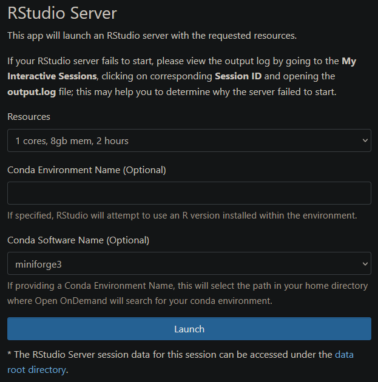

# Open OnDemand

!!! info

    This page **has** been rewritten for CX3 Phase 2.

[Open OnDemand](https://openondemand.org/) (OOD) is a service that enables interactive applications to run as "batch" jobs on a normal HPC facility; these applications are then accessed via a web browser. The OOD service at Imperial is primarily focused on R and Rstudio. The URL for the OOD service hosted by the Imperial College RCS team is:

[https://openondemand.rcs.ic.ac.uk/](https://openondemand.rcs.ic.ac.uk/)

You must be registered with the HPC service in order to use the OOD service.

We recommend you setup a [Conda](./conda.md) environment when using RStudio; these instructions demonstrate how to do this.

## Creating a Conda Environment

We recommend you familiarise yourself with the use of Conda and R by going to the [R application page](./R.md). You will then need to prepare your Conda environment by first connecting to the login node using SSH (see the [Getting started](../../getting-started/index.md) guide for advice on doing this).

!!! info
	If you have not setup Conda yet, please do so first by following both sections - [Using Conda](./conda.md#using-conda) and [Anaconda Licensing](./conda.md#anaconda-licensing)

Once you've done that, you can now create a Conda environment to use within OOD.

```console
module load miniforge/3
eval "$(~/miniforge3/bin/conda shell.bash hook)"
conda create -n Renv r-base=4.1.2 -c conda-forge
```

The name after "-n" is a unique name for this environment, you can set this to whatever you see fit. Once that completes, you can install any other packages you may need. This environment can then be activated with:

```console
source activate Renv
```

!!! warning
	Users should **not** install packages using install.packages or Cran as this may lead to conflicts, instead use Conda to install them.

For example, to install tidyverse, you can do:

```console
(Renv) conda install -c conda-forge r-tidyverse
```

To find packages, either search on the [Anaconda website](https://anaconda.org/search), or use the following replacing `package_name` with the name of the R package to be installed:

```text
(Renv) conda search "package_name"
```

Once all packages have been install OOD can be started.

## Starting Open OnDemand
Open a web browser and go to [https://openondemand.rcs.ic.ac.uk/](https://openondemand.rcs.ic.ac.uk/). Log in with your university username and password if needed. 

To start a new session click on **Interactive Apps** at the top of the page and select 


Once the page load it will look something like the following,



1. From the Resources drop down list select the most appropriate instance. 
1. In the text box below labelled "Conda Environment Name (Optional)" input the name of the environment we created above ("Renv" in this case), or any other environment you've previously created. 
1. The option "Conda Software Name (Optional)" supports different Conda distributions such as `anaconda3`, `miniforge3` and a few others. This can be changed so that you select the correct distribution which you've got your Conda environment installed in. 
1. Click launch and the job will join a queue. Please be patient while your job sits in queue. The wait time depends on the number of cores and time requested as well as how busy the queue is. 
1. Once it starts, a button labelled "Connect to RStudio Server" should appear.

Clicking on that will start up Rstudio in a new window using the created Anaconda environment. 


## Installing packages on Open OnDemand
Once the above has been followed, users can install new packages via the Rstudio Terminal.

!!! warning
	As mentioned above, users should **not** install packages using install.packages or Cran, as this may lead to conflicts, instead use Conda to install them.


At the top left of the screen select the tab called Terminal. This will drop the user in to a bash screen on the compute node the job is running. This can be useful for running monitoring command like top or free but here it will be used to install packages. 


First the R environment needs to be loaded, which is done in a similar way to before.

```console
eval "$(~/miniforge3/bin/conda shell.bash hook)"
source activate Renv
```

Packages can then be installed. For example, to install tidyverse, you can do:

```console
(Renv) conda install -c conda-forge r-tidyverse
```

To find packages, either search on the [Anaconda website](https://anaconda.org/search) or use the following replacing "package_name" with the name of the R package to be installed,

```console
(Renv) conda search "package_name"
```

The session doesn't need to be reloaded once packages are installed, simply switch back to the Console tab and load them as normal. This process only needs to be done once to install the required packages, they will persist for future sessions.

## Clearing browser cache

Open on-Demand uses single sign-on to allow users to connect without having to input their password every time. However, this can sometimes become corrupted, preventing users from even loading the OOD home page. The issue can be identified if you are able to login via an Incognito or private browsing window but not via your normal browser. If closing all browser windows doesn't help then you may have to clear your browser cache. Below is some guidance on how to do this for the major browsers.

### Clearing browser cache on Firefox:

1. Open Firefox and click on the menu button (three horizontal lines) in the top-right corner.
1. Select "Options" (Windows) or "Preferences" (Mac).
1. In the left sidebar, click on "Privacy & Security."
1. Scroll down to the "Cookies and Site Data" section.
1. Click on the "Clear Data" button.
1. Ensure that the "Cached Web Content" option is selected.
1. Click on the "Clear" button.
1. Restart Firefox to complete the process.

### Clearing browser cache on Microsoft Edge:

1. Open Microsoft Edge and click on the menu button (three horizontal dots) in the top-right corner.
1. Select "Settings."
1. Under the "Clear browsing data" section, click on "Choose what to clear."
1. Check the box next to "Cached data and files."
1. Optionally, you can select other types of data you want to clear.
1. Click on the "Clear" button.
1. Restart Microsoft Edge to complete the process.

### Clearing browser cache on Google Chrome:

1. Open Google Chrome and click on the menu button (three vertical dots) in the top-right corner.
1. Select "Settings."
1. If needed, scroll down and click on "Advanced" to expand the advanced settings.
1. Under the "Privacy and security" section, click on "Clear browsing data."
1. Select "All time" to clear all cache.
1. Ensure "Cookies and other site date" is selected
1. Click on the "Clear data" button.
1. Restart Google Chrome to complete the process.
