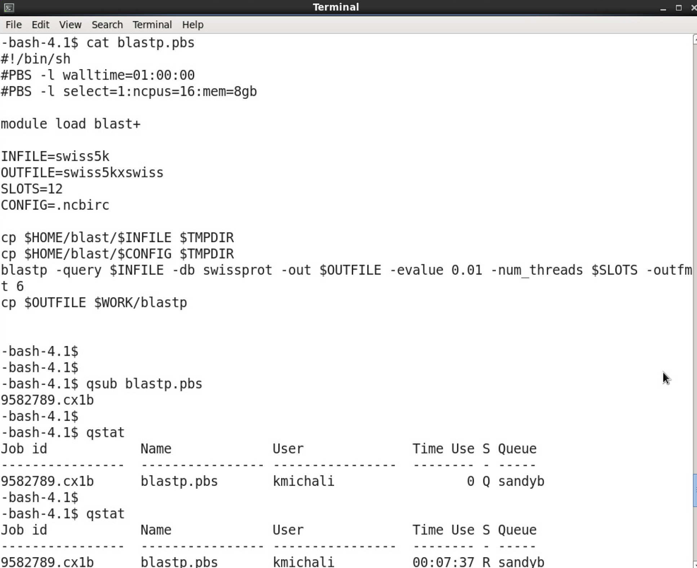

# Running your first job

!!! info

    This page has not yet been rewritten for CX3 Phase 2.

The Imperial HPC facility is a batch processing system. Rather than carrying out work directly on the command line, jobs are submitted to the queue of a work manager (or resource scheduler) where they are held until compute resource become free. A job is defined by a shell script that contains all of the commands to be run.

The Imperial HPC facility uses the PBSPro workload manager, which some existing HPC users may be familiar with using on other HPC facilities.


## Anatomy of a job script

The very first line of a PBSPro job submission script specifies the interpreter or shell that should be used to execute the script. This line is sometimes called a "shebang" line or "hashbang" line. At Imperial we only support using the default Bash interpreter so this line should also be,

```bash
#!/bin/bash
```

Every job script must include two lines that describe the resources required by the work. The first specifies the maximum amount of time the job will be allowed to run for in hours:minutes:seconds:

```bash
#PBS -lwalltime=HH:MM:00
```

The second gives the the number of cores N and memory M that the job needs. These are per-node and here only a single node is request. Requesting more nodes only makes sense if your code is able to run across multiple nodes:

```bash
#PBS -lselect=1:ncpus=N:mem=Mgb
```

Next comes the module loads for all of the software the job needs. Imperial has shifted to using EasyBuild for software installations so you will first need to load the production environment. The example below does this and then loads the SciPy bundle that includes many commend Python libraries:

```console
module load tools/prod
module load SciPy-bundle/2022.05-foss-2022a
```

The initial working directory of a job is a private temporary directory created locally on the head node just for the job, and deleted once it is done. Take that into account when crafting paths to input files. The path of the directory that the job was submitted from is present in the environment variable PBS_O_WORKDIR, and that of the temporary directory in TMPDIR. For this simple example we will stick to using PBS_O_WORKDIR but if you job has a lot of IO it would be best to copy data to TMPDIR and work on it locally.

```bash
cd ${PBS_O_WORKDIR}
```

Next come the commands for the program you actually want to run, for example:

```bash
python myprog.py path/to/input.txt
```

So putting it all together we might get something like the following, where we are asking for 1 cpu and 1 gb of ram on a single node and then running a Python scirpt.

```bash
#!/bin/bash
#PBS -l select=1:ncpus=1:mem=1gb
#PBS -l walltime=00:01:00
#PBS -N hello_world
 
cd $PBS_O_WORKDIR
 
module load tools/prod
module load SciPy-bundle/2022.05-foss-2022a
 
python myprog.py path/to/input.txt
```

Open a file with a text editor (nano, vim, emacs) and save it as job.sh. You can then submit this with 

```console
qsub job.sh
```

## Copying to load storage

As mentioned, your job will start in `$TMPDIR`. If your workflow has a lot of file system access (reading and/or writing - IO) it is better to copy data here, process it and then finally, copy any output files back from `$TMPDIR` to permanent storage in your WORK or HOME directory. Have a look at the following example that stages the bam file locally and the copy backs the result. 

```bash
#!/bin/bash
#PBS -l walltime=02:00:00
#PBS -l select=1:ncpus=1:mem=1gb
  
module load tools/prod
module load SAMtools/1.16.1-GCC-11.3.0
  
# Copy input file to $TMPDIR
cp $HOME/project1/inputs/some_sample.bam $TMPDIR
  
# Run application. As we have not changed directory, currently location is $TMPDIR
samtools view -S -b some_sample.bam > sample_output.bam
  
# Copy required files back
cp $TMPDIR/sample_output.bam $HOME/project1/outputs/
```

One this to note is that the local storage may only be 200 GB so you will not be able to copy more than that over.

## Choosing job resources

It's very important that you accurately specify the jobs' resource requirements in the #PBS directives.

Advice on choosing the right resource requirements for your work is in our job sizing guidelines. As a general rule, the smaller the resource request, the less time the job will spend queuing.

## Submitting and monitoring a job
Submit a job with the following command:

```console
qsub your_job_script
```

Once a job is submitted, you can follow its progress with qstat command. 

The image below shows an example of a job script being submitted.  The job script is called blastp.pbs, it starts a BLAST job on 16 cores on one node.  The job is started with qsub blastp.pbs. This will return a unique id for the job (9582789). 



Jobs belonging to one user can be monitored with `qstat`. In the example below, the first invocation shows the job waiting in the queue (status "S" is "Q"). The second time, it shows that the job is running "R".

When a job finishes, it disappears from the queue. Any text output is captured by the system and returned to the submission directory, in two files named after the jobscript and with the job id as suffix.

If you need to delete a job, ether while it is still queuing, or running, use the command

```console
qdel jobid
```

## Where to go on from here

Now that you know how to write and submit a job script, there are a number of sections of in the documentation which you may find useful:

* [Queueing System](../queues/index.md) - from here you will find out more information on how the queuing system works and the different classifications of jobs. 
* [Job sizing guidance](../queues/job-sizing-guidance.md) - this page will provide you advice on the resource requests you make to the job scheduler.
* [Best practice](../best-practice.md) - this page will provide you general best practice for running jobs on the HPC service
* [Applications](../applications/index.md) - from this section you will find links to advice on how to run certain applications on the HPC facility.
* [Research Data Store](../../rds/index.md) - this section gives you details on using the Research Data Store.
