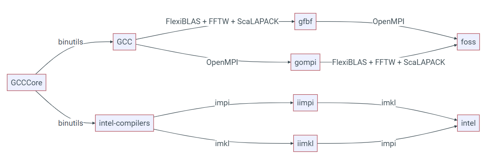

# HX1

HX1 (or Hex) is the new High Performance Computing Cluster provided by the Research Computing Services at Imperial College London. HX1 is designed for the following types of applications:

* Multi-node parallel applications, typically using MPI to communicate between the compute nodes.
* GPU accelerated scientific applications that require double precision. 

For single node applications or GPU applications using single precision, we would please ask you to continue using the CX3 service. For AI work we recommend using [CX3 Phase 2](./cx3-phase2.md) as the L40s GPUs have a newer microarchitecture (Ada Lovelace) and higher FP32 so they tend to be faster fo AI/ML workloads. If you are in any doubt whether your job is suited to HX1, please contact the [RCS](../../support/index.md).

## Cluster Specification

Please go to the [HX1 section of our cluster specification page](../cluster-specification.md#hx1) for details of HX1.

## Access

!!! info

    HX1 is designated for high-performance computing (HPC) users who run multi-node or GPU-accelerated workflows, requiring more than 48GB of GPU RAM and/or strong double-precision performance. Users should have demonstrable experience with HPC clusters. This restriction is in place to ensure the efficient running of the HX1 facility for those users wishing to run large scale workloads.

All users must already have access to the RCS HPC service - see [https://www.imperial.ac.uk/admin-services/ict/self-service/research-support/rcs/get-access/](https://www.imperial.ac.uk/admin-services/ict/self-service/research-support/rcs/get-access/) for more information before applying for access to HX1. Once you have access to the main RCS HPC facility, you can apply for access using [ServiceDesk Ask form](https://servicemgt.service-now.com/ask?id=sc_cat_item&sys_id=cbf5a4281b9c79101533a8a4bd4bcbea&sysparm_category=52a4a8f21be62110557837b5464bcbd24).

### Groups

Once you have been granted access to hx1, you will be added to the **hpc-hx1** secondary group, which will enable you to login to the service. Your primary group on HX1 will be the same as your primary group on the main CX3 systems.

### Connecting to HX1

There are two login nodes for hx1 which are accessible over ssh. These can be accessed using the login.hx1.hpc.ic.ac.uk hostname.

!!! warning

    The HX1 login nodes only have ipv6 addresses meaning you must be connected to the campus in such a way that you access IPv6 addresses. Our guide on [Remote Access](../../remoteaccess.md) provides further details.

## Storage
### Research Data Store

HX1 has its own dedicated high performance file system utilising the IBM General Parallel File System (GPFS), running on Lenovo hardware. This separation between HX1 and the RDS ensures that high loads generated by HX1 do not adversely affect the RDS and, problems with the RDS do not cause job failures on HX1. This means that you must move data to your HX1 home directory before running jobs (sftp/rsync and other similar tools can be used to transfer data from the RDS to HX1 during this pilot phase). Please read the following sections for more information.

Currently the RDS is not connected/mounted to HX1 in any way and you must use tools such as sftp/ssh/rsync to transfer data from the RDS to HX1. This separation remains in place to ensure that file system load on HX1 does not affect the RDS and vice-versa.

### Home Directory

When you login to HX1, you will have a home directory automatically created for you on the file system local to HX1. User home directories on HX1 are intended to provide working space for current jobs only and it is the expectation that users will move their data to other systems (such as the RDS) once the data is no longer needed on the cluster. Accordingly, there are **NO BACKUP, DISASTER RECOVERY OR SNAPSHOTS** for HX1 (as these affect performance of the filesystem) and in the event of major hardware failure, accidental data deletion, file system corruption, etc. the data will be lost. It is therefore important you copy any important files back to another storage system such as the RDS once they have been generated.

### Quota
Your home directory on hx1 is subject to a default quota of 1 TB and 2 million files/directories (inodes).

Use the `mmlsquota` command to determine your specific quota level and usage:

```console
/usr/lpp/mmfs/bin/mmlsquota --block-size auto /dev/gpfs
```

Quota increases are possible on request if justified. We ask that users make efforts to:

* Minimise the amount of data that needs to be stored for live projects.
* Avoid having large numbers of files within their home directory.

Users who request a quota increase but are storing many unused files in their home directory will be asked to move or remove these files first before a quota increase is granted. Any quota increases above the default values will be re-assessed every 6 months and users may be asked to provide an updated justification for their quota level.

### Retention of Data
The HX1 file system is meant for live data only and any important files should be copied elsewhere (including to the RDS) after being generated. Minimising the amount of data stored on the HX1 filesystem ensures that it maintains the high performance we need it for. For these reasons, RCS staff will be undertaking the following steps to ensure that the file system is only used for live data:

* If RCS staff believe that a user is storing unused data in their home directory, then they may be contacted and asked to move the data to another storage space if justification cannot be provided.
* If RCS staff believe an account on HX1 has been unused for 6+ months, then we will contact the user and ask them to clean up their home directory. If we have not received a response from the user or registered supervisor within 6 weeks, then the RCS staff reserve the right to remove the data from the home directory.
* If a user leaves the university and their account becomes deactivated, then the data in that home account will be removed promptly after the user has left. It is the responsibility of the user to ensure that a copy of important data exists elsewhere before they leave the university.

### Shared Project Areas

We are still working on a solution for shared project areas, however we welcome requests for these from either HPC or RDS Project Admins. There will be no charge for these shared spaces but they are for live data sharing only and any quota must be justified (with a review every 6 months). As with home directories, data within these shared areas that have not been accessed for some time are at risk of being deleted.

## Software

This section will explain how to access software that has been centrally installed on HX1.

Please make sure any software you run on HX1 has been optimised for the hardware. Ideally use software provided by us (which has already been optimised) or otherwise please make sure to use relevant optimisation flags when compiling your own software. Please avoid simply copying binaries from other systems such as CX3, unless the software is commercial and/or only the binary is available.

### EasyBuild

Most software that we provide centrally will have been built and installed using the [EasyBuild](../applications/easybuild.md) system and will be optimised/tested for the hardware. If you need a relatively well known unmodified application (for example GROMACS or CP2K), we ask that you contact us first to install it rather, than build it yourself.

EasyBuild builds software using the concept of [toolchains](https://docs.easybuild.io/common-toolchains/). These toolchains will typically consist of a compiler, mpi distribution and set of maths libraries. On hx1 we tend to provide software based on two toolchains, foss (GCC, OpenMPI, FlexiBlas etc.) and intel (Intel Compiler Suite, Intel MPI and Intel MKL) and each toolchain will be designated by a release number such as intel-2022b and foss-2021a; you can see the software versions for the foss and intel releases at [Common toolchains - EasyBuild - building software with ease](https://docs.easybuild.io/common-toolchains/#common_toolchains_overview).

It is important not to mix software built by two different toolchains, irrespective of whether the software has been provided by us, or you have compiled it yourself. The diagram below (from the EasyBuild documentation) demonstrates how the various toolchains relate to each other.



When compiling your own software, you can make use of the easybuild "buildenv" (such as `buildenv/intel2022b`) which sets up your environment for building software against a specific toolchain. See the section below on how to load these modules.

### Modules
Applications installed centrally on HX1 are accessible via the module system. This is setup in a very similar way to the main RCS system, but uses Lmod rather than environment modules so there may be an occasionally difference in behaviour.

The module command is used to access the Lmod system, and load/unload applications from your environment. When you first log into the login node, you will not have any modules loaded:

```console
[username@hx1-c12-login-1 ~]$ module list
No modules loaded
```

You can see a list of what applications are installed by running the module avail command (as there are many applications installed, this may take some time):

```console
[username@hx1-c12-login-1 ~]$ module avail
 
------------------------------------------- /gpfs/easybuild/prod/modules/all -------------------------------------------
   Autoconf/2.71-GCCcore-10.3.0                      binutils/2.38
   Autoconf/2.71-GCCcore-11.2.0                      binutils/2.39-GCCcore-12.2.0
   Autoconf/2.71-GCCcore-11.3.0                      binutils/2.39                           (D)
   Autoconf/2.71-GCCcore-12.2.0               (D)    buildenv/default-foss-2021a
   Automake/1.16.3-GCCcore-10.3.0                    buildenv/default-foss-2021b
   Automake/1.16.4-GCCcore-11.2.0                    buildenv/default-foss-2022a
   Automake/1.16.5-GCCcore-11.3.0                    buildenv/default-foss-2022b
   Automake/1.16.5-GCCcore-12.2.0             (D)    buildenv/default-intel-2021a
   Autotools/20210128-GCCcore-10.3.0                 buildenv/default-intel-2021b
   Autotools/20210726-GCCcore-11.2.0                 buildenv/default-intel-2022a
   Autotools/20220317-GCCcore-11.3.0                 buildenv/default-intel-2022b            (D)
   Autotools/20220317-GCCcore-12.2.0          (D)    bzip2/1.0.8-GCCcore-10.3.0
   BLIS/0.8.1-GCC-10.3.0                             bzip2/1.0.8-GCCcore-11.2.0
   BLIS/0.8.1-GCC-11.2.0                             bzip2/1.0.8-GCCcore-11.3.0
   BLIS/0.9.0-GCC-11.3.0 
...
```

A program can then be loaded into your environment with module load:

```console
[username@hx1-c12-login-1 ~]$ module load intel/2022b
```

This will load the module you need and any dependent modules:

```console
[username@hx1-c12-login-1 ~]$ module list

Currently Loaded Modules:
  1) GCCcore/12.2.0                 5) numactl/2.0.16-GCCcore-12.2.0            9) iimpi/2022b
  2) zlib/1.2.12-GCCcore-12.2.0     6) UCX/1.13.1-GCCcore-12.2.0               10) imkl-FFTW/2022.2.1-iimpi-2022b
  3) binutils/2.39-GCCcore-12.2.0   7) impi/2021.7.1-intel-compilers-2022.2.1  11) intel/2022b
  4) intel-compilers/2022.2.1       8) imkl/2022.2.1
```

Lmod provides the module spider command that can help you find the module that you need to load. For example:

```console
[username@hx1-c12-login-1 ~]$ module spider CP2K
 
--------------------------------------------------------------------------------------------------------------------
  CP2K:
--------------------------------------------------------------------------------------------------------------------
    Description:
      CP2K is a freely available (GPL) program, written in Fortran 95, to perform atomistic and molecular
      simulations of solid state, liquid, molecular and biological systems. It provides a general framework for
      different methods such as e.g. density functional theory (DFT) using a mixed Gaussian and plane waves
      approach (GPW), and classical pair and many-body potentials.
 
     Versions:
        CP2K/8.2-intel-2021a
        CP2K/9.1-foss-2022a
 
--------------------------------------------------------------------------------------------------------------------
  For detailed information about a specific "CP2K" package (including how to load the modules) use the module's full name.
  Note that names that have a trailing (E) are extensions provided by other modules.
  For example:
 
     $ module spider CP2K/9.1-foss-2022a
--------------------------------------------------------------------------------------------------------------------
```

will list all modules matching CP2K as a string and where possible, will provide you a description of the module.

### Python and Conda Environments
When using python on HX1, we recommend that users use the modules that have been installed via EasyBuild and are accessible via the module system as these packages have been tuned for the HX1 hardware. When software is not available, please raise a request and we will check if the software can be installed via EasyBuild.

We understand that it may not always be possible or desireable to use the modules we provide and users may wish to manage their python toolchains using conda/anaconda instead. For these circumstances, we have provided instructions on how to install miniconda or mambaforge in your home directory.

#### Miniconda

[Miniconda](https://docs.conda.io/en/latest/miniconda.html) is a minimal installer for conda and only provides those packages needed for setting up your conda environments. It is very quick to install and doesn't provide extra packages from Anaconda that you don't necessarily need. The following instructions are based on those found on the [Miniconda installation page](https://docs.conda.io/en/latest/miniconda-install.html), but have been adapted for HX1.

Create a directory for miniconda and download the latest installer file:

```console
[username@hx1-c12-login-1 ~]$ mkdir -p ~/miniconda3
[username@hx1-c12-login-1 ~]$ curl https://repo.anaconda.com/miniconda/Miniconda3-latest-Linux-x86_64.sh -o ~/miniconda3/miniconda.sh
  % Total    % Received % Xferd  Average Speed   Time    Time     Time  Current
                                 Dload  Upload   Total   Spent    Left  Speed
100 98.4M  100 98.4M    0     0   135M      0 --:--:-- --:--:-- --:--:--  135M
```

Then run the installer, setting `~/miniconda3` as the target installation directory, and remove the installer when done.

```console
[username@hx1-c12-login-1 ~]$ bash ~/miniconda3/miniconda.sh -b -u -p ~/miniconda3
PREFIX=/gpfs/home/username/miniconda3
Unpacking payload ...
 
Installing base environment...
 
 
Downloading and Extracting Packages
 
 
Downloading and Extracting Packages
 
Preparing transaction: done
Executing transaction: done
installation finished.
[username@hx1-c12-login-1 ~]$ rm ~/miniconda3/miniconda.sh
```

Our recommended way of using your installed conda is to run the setup script for the bash shell

```console
[username@hx1-c12-login-1 ~]$ eval "$(~/miniconda3/bin/conda shell.bash hook)"
(base) [username@hx1-c12-login-1 ~]$ conda env list
# conda environments:
#
base                     /gpfs/home/username/miniconda3
[username@hx1-c12-login-1 ~]$ conda activate base
(base) [username@hx1-c12-login-1 ~]$
```

If you are not using the base environment, we recommending you disable automatically loading this.

```console
(base) [username@hx1-c12-login-1 ~]$ conda config --set auto_activate_base false
```

If you prefer instead to use the conda init method (note we do see issues with some jobs when this is used), we again recommend you disable automatically loading the base environment.

```console
[username@hx1-c12-login-1 ~]$ ~/miniconda3/bin/conda init bash
modified      /gpfs/home/username/.bashrc
 
==> For changes to take effect, close and re-open your current shell. <==
 
[username@hx1-c12-login-1 ~]$ source .bashrc
(base) [username@hx1-c12-login-1 ~]$ conda config --set auto_activate_base false
```

#### MambaForge
[Mamba](https://mamba.readthedocs.io/en/latest/index.html) is a drop in replacement for conda that is generally much faster; most of the time the environments created with mamba are identical with those created by conda.

[Miniforge](https://github.com/conda-forge/miniforge) is a minimal installer for conda that is pre-configured to use the [conda-forge](https://conda-forge.org/ ).

MambaForge is therefore a Miniforge installer which installers mamba into the base environment. The following instructions show how to install Mambaforge-pypy3 (mambaforge that also includes pypy3) into your home directory.,

Download the installer to a suitable location (such as your home directory):

```console
[username@hx1-c12-login-1 ~]$ curl -L https://github.com/conda-forge/miniforge/releases/latest/download/Mambaforge-pypy3-Linux-x86_64.sh -o mambaforge.sh
  % Total    % Received % Xferd  Average Speed   Time    Time     Time  Current
                                 Dload  Upload   Total   Spent    Left  Speed
  0     0    0     0    0     0      0      0 --:--:-- --:--:-- --:--:--     0
  0     0    0     0    0     0      0      0 --:--:-- --:--:-- --:--:--     0
100 90.2M  100 90.2M    0     0   103M      0 --:--:-- --:--:-- --:--:--  619M
```

And run the installer. You'll be asked a number of questions such as to read the license and where you want the program installed, it's important to read and follow these instructions.

```console
[username@hx1-c12-login-1 ~]$ bash mambaforge.sh
 
Welcome to Mambaforge-pypy3 23.3.1-0
 
In order to continue the installation process, please review the license
agreement.
Please, press ENTER to continue
>>>
 
Do you accept the license terms? [yes|no]
[no] >>> yes
 
Mambaforge-pypy3 will now be installed into this location:
/gpfs/home/username/mambaforge-pypy3
 
  - Press ENTER to confirm the location
  - Press CTRL-C to abort the installation
  - Or specify a different location below
 
[/gpfs/home/username/mambaforge-pypy3] >>>
PREFIX=/gpfs/home/username/mambaforge-pypy3
Unpacking payload ...
 
Transaction finished
installation finished.
Do you wish the installer to initialize Mambaforge-pypy3
by running conda init? [yes|no]
[no] >>>
 
 
You have chosen to not have conda modify your shell scripts at all.
To activate conda's base environment in your current shell session:
 
eval "$(/gpfs/home/username/mambaforge-pypy3/bin/conda shell.YOUR_SHELL_NAME hook)"
 
To install conda's shell functions for easier access, first activate, then:
 
conda init
 
If you'd prefer that conda's base environment not be activated on startup,
   set the auto_activate_base parameter to false:
 
conda config --set auto_activate_base false
 
Thank you for installing Mambaforge-pypy3!
```

Then to make mamba/conda etc. available, evaluate the setup script:

```console
[username@hx1-c12-login-1 ~]$ eval "$(/gpfs/home/username/mambaforge-pypy3/bin/conda shell.bash hook)"
(base) [username@hx1-c12-login-1 ~]$
```

## Job Submission

HX1 uses the PBS Pro job scheduler, as with the main CX1/CX3 system. However, this is a new installation of PBS Pro and there are a lot of differences in how PBS directives work as compared to the existing RCS HPC systems. It is therefore important that:

* You review this section in its entirety before submitting any jobs
* You don't simply copy your existing submission script to HX1 and run it, without any modification.

### Submitting Jobs

The qsub command can be used to submit jobs to the queue, but on HX1 you must specify the hx queue i.e.:

```console
qsub -q hx myjob.pbs
```

### Explanation of PBS Directives
The following table provides an explanation of what each directive means in the context of your resource request on hx1. 

| Directive | Description |
| --------- | ----------- |
| `select` |This is the number of compute nodes you wish to use in your job. Most users on hx1 will be wanting to use more than 1 compute node e.g. select=4 means you are requesting 4 compute nodes |
| `ncpus` | This is the number of compute cores to allocate to your job, on each allocated compute node. Most HX1 users will want to use entirely compute nodes and should therefore be setting this as `ncpus=64`. You should ALWAYS set this option irrespective of what type of job you want to run. |
| `mpiprocs` | This is the number of mpi processes you would like to run per allocated compute node. For example, if you want to run 64 mpi processors, you would set `mpiprocs=64` |
| `ompthreads` | This is the number of openmp threads you want to set, or to be more specific, it sets the OMP_NUM_THREADS environment variable in your job. This is set to 1 by default.|
| `mem` | This is the amount of memory to allocate to the job per compute node. | 
| `place` | Sets how the processes for be places on the nodes. The default is "free" which puts them where ever there is space |

### Job Sizing Guidance

The following queues of jobs are supported:

| Queue | Use Cases | Nodes per job | No. of cores per node<br>(ncpus) | Mem per node<br>(GB) | Walltime<br>(hrs) |
| ----- | --------- | :-------------: | ---------------------------- | -------- | -------------- |
| [small24](#single-core-to-single-node-jobs) | Low core jobs 24h | 1 | 1 - 16 | 1 - 128 | 0 - 24 |
| [small72](#single-core-to-single-node-jobs) | Low core jobs 72h | 1 | 1 - 16 | 1 - 128 | 24 - 72 |
| [medium24](#single-core-to-single-node-jobs) | Single-node jobs 24h | 1 | 1 - 64 | 1 - 450 | 0 - 24 |
| [medium72](#single-core-to-single-node-jobs) | Single-node jobs 72h | 1 | 1 - 64 | 1 - 450 | 24 - 72 |
| 4nodes24 | Two to four node jobs 24h | 2 - 4 | 1 - 64 | 1 - 450 | 0 - 24 |
| 4nodes48 | Two to four node jobs 48h | 2 - 4 | 1 - 64 | 1 - 450 | 24 - 48 |
| [capability24](#capability24) | Large multi-node jobs 24h | 5 - 32 | 1 - 64 | 1 - 450 | 0 - 24 |
| [capability48](#capability48) | Large multi-node jobs 48h | 5 - 32 | 1 - 64 | 1 - 450 | 24 - 48 |
| [a100](#a100) | Main queue for gpu jobs* | 1 | 1 - 72 | 1 - 920 | 0 - 72 |

\* Please see details for specific queues below as there may be additional restrictions or limitations.

#### single core to single node jobs

Small jobs (single core to single node) should not be routinely run on HX1 other than as part of a wider workflow as these jobs take away from the limited resource pool set aside for multi-node jobs. These jobs are better suited to the [CX3 legacy](../getting-started/index.md) and [CX3 Phase 2 facilities](./cx3-phase2.md).

#### capability24

The maximum number of cpus allocated to a capability24 job is 2048.

#### capability48

The maximum number of cpus allocated to a capability48 job is 2048.

#### a100

There is an additional limit of 12 GPU's total per user on the a100 queue to allow for fair usage of the GPUs.

### Example PBS Jobs
#### MPI Jobs

The following example requests 8 compute nodes, 64 cores and 200GB of RAM per compute node, and running 64 MPI tasks per compute node (for a total of 512 mpi tasks).

```bash
#PBS -l select=8:ncpus=64:mpiprocs=64:mem=200gb
```

The following example differs from the previous example by still requesting all available cores on each node but only running 32 MPI tasks (256 mpi tasks in total). You may do this if you wanted to under-subscribe the nodes.

```bash
#PBS -l select=8:ncpus=64:mpiprocs=32:mem=200gb
```

#### Hybrid OpenMP/MPI Jobs
The following example requests 8 compute nodes, 64 cores and 200GB RAM per compute node, and running 32 MPI tasks on each node (for a total of 256 mpi tasks), each task with 2 OpenMP threads.

```bash
#PBS -l select=8:ncpus=64:mpiprocs=32:ompthreads=2:mem=200gb
```

Please be careful with hybrid jobs as some MPI distributions (such as OpenMPI) automatically pin the processors to cores and unless you specify the pinning method, you may lose significant performance (further details below). It is also advisable to change the default process placement from "free" to "scatter" to ensure the MPI ranks are distributed evenly across the requested nodes.

### MPI Distribution Specific Information

#### Intel MPI
The following example demonstrates how the HPCG benchmark application, built with the centrally installed Intel toolchain, can be run across multiple compute nodes (please adapt these for your own purposes):

```bash
#!/bin/bash
#PBS -l walltime=00:30:00
#PBS -l select=2:ncpus=64:mpiprocs=64:mem=200gb
 
cd $PBS_O_WORKDIR
 
module purge
module load HPCG/3.1-intel-2022a
  
mpirun -v6 xhpcg
```

Note that it is not necessary to provide Intel MPI with a lists of hosts because it can determine this directly from PBS Pro. For hybrid jobs, you can simply follow the advice above e.g.:

```bash
#!/bin/bash
#PBS -l walltime=00:30:00
#PBS -l select=2:ncpus=64:mpiprocs=32:ompthreads=2:mem=200gb
#PBS -lplace=scatter
 
cd $PBS_O_WORKDIR
  
module purge
module load HPCG/3.1-intel-2022a
 
mpirun -v6 xhpcg
```

Will run 32 mpi process per node, 2 OpenMP threads per task. Note the extra "place" directive. 

##### Bootstrapping Intel MPI
If you decide to install your own version of Intel MPI, you should set the following environment variables:

```bash
export I_MPI_HYDRA_BOOTSTRAP="rsh"
export I_MPI_HYDRA_BOOTSTRAP_EXEC="/opt/pbs/bin/pbs_tmrsh"
export I_MPI_HYDRA_BRANCH_COUNT=0
```

and start the job with either `mpirun -v6` or `mpiexec -v6`. 

#### OpenMPI
The following example demonstrates how the HPCG benchmark application, built with the centrally installed Foss (GCC/OpenMPI) toolchain, can be run across multiple compute nodes:

```bash

#!/bin/bash
#PBS -l walltime=00:30:00
#PBS -l select=2:ncpus=64:mpiprocs=64:mem=200gb
  
cd $PBS_O_WORKDIR
  
module purge
module load HPCG/3.1-foss-2022a
  
mpirun hpcg
```
For hybrid jobs, this is more complicated because by default OpenMPI pins MPI processes to cores. Again note the scatter directive for Hybrid jobs. 

```bash
#!/bin/bash
#PBS -l walltime=00:30:00
#PBS -l select=2:ncpus=64:mpiprocs=32:ompthreads=2:mem=200gb
#PBS -lplace=scatter
 
cd $PBS_O_WORKDIR
cat $PBS_NODEFILE
 
module purge
module load HPCG/3.1-foss-2022a
 
mpirun --map-by numa:PE=${OMP_NUM_THREADS} xhpcg
```

This will ensure that each a number of processing elements (numa domains) equal to `OMP_NUM_THREADS` is bound to each mpi process. Alternatively the cpu binding can be disabled with:

```bash
mpirun --bind-to none xhpcg
```

### GPU Jobs
#### GPU Specification
| GPU Type | Single Precision<br>TFLOPS | Double Precision<br>TFLOPS | Memory<br>GB | Memory Bandwidth<br>GB/s | CUDA Compute Capability | GPU Architecture |
| -------- | -------------------------- | -------------------------- | ------------ | ------------------------ | ----------------------- | ---------------- |
| A100 80GB SXM | 19.5 | 9.7 | 80 | 2,039 | 8.0 | Ampere |

#### Multi-node GPU Jobs
We are observing some issues with some multi-node GPU jobs on HX1, namely the AI frameworks such as Tensorflow and PyTorch do not appear to either run in a performant manner or are simply not able to establish an connection between compute nodes. We presently believe this is mostly likely due to a lack of compatibility of these frameworks with working in an IPv6 network environment. We are continuing to work towards finding a solution for this.

GPU accelerated "science codes" such as GROMACS and LAMMPS appear to work fine in a multi-node environment.

#### Example GPU Jobs

```bash
#!/bin/bash
#PBS -l walltime=00:30:00
#PBS -l select=1:ncpus=18:mem=200gb:ngpus=1:gpu_type=A100
 
cd $PBS_O_WORKDIR
cat $PBS_NODEFILE
module purge
module load TensorFlow/2.11.0-foss-2022a-CUDA-11.7.0
 
python my_TF_code.py
```

Here we have requested 18 cpus and 200 gb of RAM as the nodes have a total of 72 cpus and 1 TB of ram with 4 GPUs. So users should ideally request no more than 25% of that. 

##### MPI GPU Jobs (single node)

When using MPI you must specify the number of MPI processes in the PBS select directive or PBS will default to 1 process. For example,

```bash
#!/bin/bash
#PBS -l walltime=00:10:00
#PBS -l select=1:ncpus=2:mpiprocs=2:mem=80gb:ngpus=2:gpu_type=A100
 
cd $PBS_O_WORKDIR
cat $PBS_NODEFIL
 
module purge
module load NCCL/2.12.12-GCCcore-11.3.0-CUDA-11.7.0
module load OpenMPI/4.1.4-GCC-11.3.0
 
mpirun -n 2 ./your_job
```

## Known Issues
### Intel MPI 2021b jobs not starting

**Updated 3rd Jan 2024**: We believe this issue has now been fixed. If you continue to see an issue using Intel MPI 2021a/b, please let us know by raising a ticket.

We've observed an issue with Intel MPI 2021b jobs not starting on the cluster as communication cannot be established between the nodes. While we identify the cause of the issue, please use 2022a and newer if possible.
