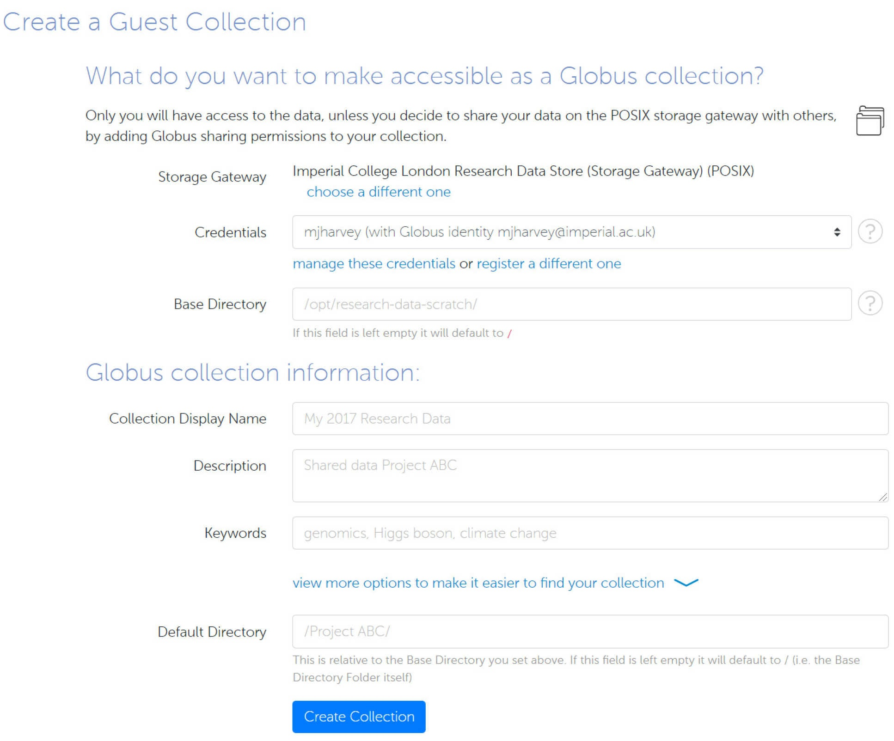

# Globus

[Globus](https://www.globus.org/) is a high performance data transfer platform. The RCS run a Globus "endpoint" from which you can:

* **Transfer** large volumes of data between the RDS, your personal computer and Globus-accessible storage at other institutions
* **Share** RDS project allocation data with selected third parties, without requiring them to have a College account (Globus identity required)

## Logging in to Globus

Step 1: Log in to Globus

Visit [https://app.globus.org](https://app.globus.org), please select **Imperial College London** from the trusted organisations in the drop down list:

The first time you log in you will be asked to complete the registration for a Globus account.

If you have a username and password for any of the institutions you wish to transfer data with, repeat this process to [associate these other identities](https://app.globus.org/account/identities). You can also do this at any later time via "Link another identity" in the web application's Account settings.

Once logged in, you will see the Globus web application File Manager:

From here you will be able to browse your files and folders in the different **collections**. An endpoint is a location where data resides. The RDS collection is called Imperial College London Research Data Store.

## Transferring Data

Step 1: Under [File Manager](https://app.globus.org/file-manager), in the collection field, select or search for a specific endpoint The RDS collection is called Imperial College London Research Data Store.

Step 2: Choose the files/folders you wish to transfer and on the right pane select "**Transfer or Sync to...**"

Step 3: This will open a second panel for the destination. Repeat the process to select a destination endpoint and folder.

Step 4: Optionally choose additional options for the transfer in the tab at the bottom. By default file integrity of transferred files will be checked after the copy is complete. All transfers to the RDS will be encrypted in transit.

Step 5: To commence the transfer, click "**Start**" A new transfer request will be created. Details on the transfer and progress can be monitored in the **Activity** tab.

Step 6: You will receive an email notification once the transfer has completed.

## Sharing Data in RDS Project Allocations

The information below is adapted from [https://docs.globus.org/how-to/share-files/](https://docs.globus.org/how-to/share-files/)

If you are the owner or delegated administrator of an RDS project allocation, you have the ability to selectively share data from your project allocations with anyone with a Globus account, without requiring them to have an Imperial College account. 

If the person you wish to share with already has an Imperial College account, then all you need to do is add them to the relevant [RDS access control group](https://selfservice.rcs.imperial.ac.uk/groups/manage/rds/). This will give them direct access as shown above. 

To share data you create a new guest collection:

Step 1: Starting from the Globus web application, go to [Endpoints](https://app.globus.org/endpoints) and search for "Imperial College London Research Data Store Sharing"

Step 2: Go to the Collections tab and select "Add a new Collection". Log in with your college identity when challenged, and then select  Imperial College London Research Data Store (Storage Gateway) (POSIX)

You will now see:

To complete this:

* credentials leave this as your Imperial College identity. The guests you share this collection with will have at most the same amount of access that you do. It's not possible to give read or write access to files that you yourself don't have. When setting up the sharing later, you will have the option to further restrict guests to have read-only access.
* base directory this is the RDS path from which the sharing will start. Start it with /project/RDS project shortname/live/   All the files and folders below this point will be shared within this new collection. Don't make it broader than you need to, or you may share more than you intended. When setting up the sharing later, you have the option to further restrict access to subfolders. 
* collection display name  a meaningful name for the collection, this is the name used to search for the collection when setting up a file transfer

Step 3: Click on Create Collection then "Share data on this collection with other users", then click on "Add Permissions - Share With". To complete this:

* **path** the folder from which to start the sharing. This is relative to the base directory you specified earlier. The default is "/" - sharing everything in the base directory and below
* **username or email** the person you wish to share with. This should be an institutional ID that the person can log in to Globus with.
* **permissions** you may grant write access for the user. Note if you can't grant write access to files or folders that you yourself can't write.

Step 4: Click "**Add Permission**" to activate the sharing

Step 5: Repeat as necessary. You can return to the sharing configuration at any time finding your collection under [Endpoints](https://app.globus.org/endpoints), "Administered by You". Click the ">" and then select the "Sharing" tab.

Step 6: If you are making several collections, you may find it convenient to create [Groups](https://app.globus.org/groups).

## Transfer data to your Personal Computer using Globus
For transferring data to your own computer, or another resource that doesn't have its own Globus endpoint, you will need to install [Globus Connect Personal](https://www.globus.org/globus-connect-personal). This creates a Globus endpoint on your personal computer, allowing you to move data using the Globus web app.

