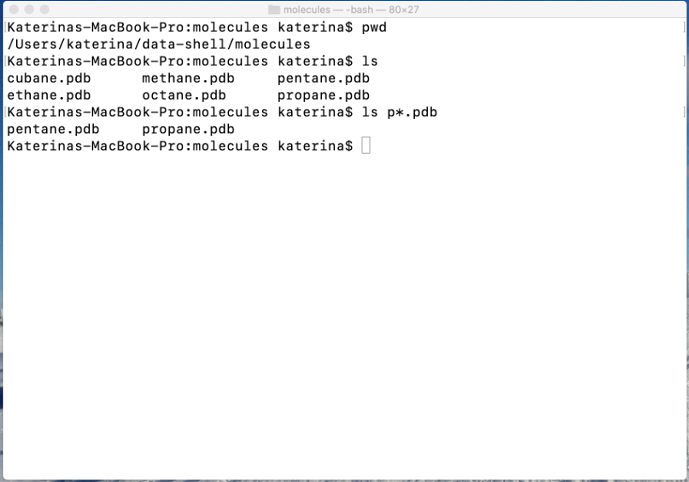

# The Linux Command Line

Computing has become an integral part of science.  While many scientific packages offer a graphical user interface, the majority require the use of the command line environment (or shell). The command line is often the only way to interact with remote systems such as high performance computing systems.

The shell is a text-based interface, where you type commands that are executed by pressing enter. You may initially find the command-line environment impractical, especially you are used interacting with computers via a graphical interface. However, with some knowledge, you'll find the command line a concise and powerful way to interact with a computer.

This tutorial gives a brief introduction to the command-line environment. Follow the commands in the tutorial on your computer to maximise your learning. 

## Setup

### Open the command line application on your laptop

On Linux or Mac, open the Terminal application. For Windows, we recommend either Git For Windows or Windows Subsystem for Linux in order to complete this course:

1. A relatively easy solution is to install Git for Windows ([https://gitforwindows.org](https://gitforwindows.org)) that does not require administrative privileges. This application comes with a command line utility.
1. Enable Windows subsystem for Linux ([https://learn.microsoft.com/en-us/windows/wsl/install](https://learn.microsoft.com/en-us/windows/wsl/install)); this requires an administrative privilege.

The shell comes in different flavours. Below is an example of the command line environment; this particular instance is a bash shell running on a MacBook Pro:

### Download practice files

1. On your laptop, download and unzip the practice files using the following link: [https://kmichali.github.io/SC-shell-novice/data/data-shell.zip](https://kmichali.github.io/SC-shell-novice/data/data-shell.zip)
1. In your Terminal, check the current working directory with `pwd` (see in the above screenshot)
1. Place the data-shell directory into the same directory using the Finder or File Explorer

## Directory listing
One of the first commands that you will need is `ls` (short for list).  This command produces a list of files and directories residing in the current directory.  

If needed, one can modify the behaviour of the command by using various command options or flags. For example:

* `ls -F` adds “/” to the directory names
* `ls -l` (lower case L) produces a "long" format displaying file permission, ownership, file size and date of modification.
* `ls -lt` that orders directory listing by modification date
* `ls -lh` that produces easy-to-read file size format
* `ls -la` shows hidden files

Most of command line tools come with multitude of flags that can be displayed by typing "man command", e.g. `man ls`. On Windows, you may have to use `ls –help`.

The screenshot below demonstrates the use of the ls command:

## File ownership and permissions
The output of `ls –l` in the above screenshot displays extra information about each file or directory. From the left:

* permissions statement (e.g., drwxr-xr-x)
* number of hard links (can be safely ignored)
* username of the owner (e.g., katerina)
* group that owner belongs to (e.g., staff)
* file size
* date of last modification
* file/directory name

File ownership and permissions provide control over actions performed on files and directories. In the above caption the owner is “katerina” and the group is “staff”.  The permission statement consists of 10 positions: -rwxrwxrwx. The first position is reserved for a directory sign (d). Ordinary files have just a “-” sign. The next three rwx triads specify permissions for the owner, group and everyone else.  Files (and directories) can be read (r), written into (w) or executed (x).  Each triad holds rwx permissions always in the same order. For example, in the –rwxrwxrwx statement all permissions are set and all users can read, write into and execute a file. In the -rw------- statement, the file can only be read and written to by the owner.

## Filesystem Paths

Many shell commands require that user specifies a position of a file in the directory tree.  This is called a path that denotes a sequence of directory names separated by a forward slash.  For example, when a user logs into a Mac, they usually find themselves in their home directory and the path looks something like this /Users/username.  A user has full permissions to all files and directories in this space. 

The path can take two forms:

* **Absolute path** always starts at the top of the tree (at the root directory), for example /home/username. The root directory is denoted with a slash “/”
* **Relative path** is the path to the destination from your current position and it does not start with a “/”; for example ./data-shell is a path to a directory called “data-shell” that resides in the current directory

The image below shows a part of a hypothetical Linux directory tree.  The root "/" usually contains subdirectories named bin, dev, etc, home, usr and tmp.  User home directories are located in /home.  If you are Bill, your home directory is /home/bill.

If Bill needs to change the current directory to “school”, he can use the appropriate command with the relative path ./school or with the absolute path /home/bill/school.

## Changing directories

The command for changing a current directory is `cd` (change directory).  The argument for cd is a path (absolute or relative).  In the example above, Bill would log and find himself in /home/bill.  Typing `cd school` would change the current working directory to /home/bill/school. 

### Special notations

There are few special notations to remember when navigating the directories:

* Typing `cd ../` will take you one directory level up (e.g., from /home/bill to /home). 
* The “./” syntax means current directory (school is the same as ./school).
* Typing `cd` anywhere will change the working directory your home directory.
* You can use “~” in the path to substitute for your home directory (e.g. `cd ~/school` is the same as `cd /home/bill/school`).
* Typing `cd` - will send you back where you just came from.  E.g. you start at /home/bill/school, then type `cd ../books` to change to /home/bill/books. Typing cd - sends you back to /home/bill/school.

In the example below, `cd data-shell/molecules` is used to change the current working directory:

## Anatomy of a command

So far, you have encountered a few commands and you may have started seeing some pattern emerging when it comes to the format of a command.  For the shell to successfully interpret a command, the syntax has to follow some rules.

We have observed:

* The **command** name comes first
* Second position is occupied by a **flag**(s) that start with “-”; the flags are optional
* Third position is also optional and is occupied by one or more **arguments** - path to a file or directory
* The command, flags and arguments are always separated by spaces

### Keyboard shortcuts

* control c will cancel the current command (before or after you press Enter)
* control a will position the cursor to the beginning of the line (just after the prompt)
* control e will position the cursor at the end of the current line
* control l (lower case L) will clear the terminal (your current prompt will be on the first line)

## Autocompletion and wildcards

Autocompletion dramatically reduces the amount of typing by completing file (or directory) names.  Start by typing a filename and press the TAB key.  If the fragment of the name is unique, pressing the TAB key will complete the name.  If the fragment is not unique, typing a second TAB will produce list of matching filenames. 

Wildcards `*` and `?` are symbols that can be used for pattern matching in file and directory names.  For example, wildcards are often used together with the `ls` command; `ls results*` produces a list of files beginning with “results” followed by zero or more characters.

* matches a text of any length including zero characters
* ? matches exactly one character.

In the example below, the current directory contains six files that have an extension “.pdb”. Typing `ls p*.pdb` will display the files that start with “p” and ends with “*.pdb”.

## Managing files and directories
This section contains examples of commands that are used to organize files and directories (or folders). Creating and deleting directories, copying, moving and deleting files are discussed.

### Make a directory – mkdir

Directories are made with `mkdir` (make directory). The command takes one argument, the path to the new directory. 

In the example below, a directory named “backup” is made:

If one specifies a longer path, all directories but the last one must already exist. If they do not exist, one can use `mkdir -p`.

In the example below, the command is used to create two new subdirectories “statistics/2021-02-05”.

### Remove a directory – rmdir

An empty directory can be removed using the `rmdir` (remove directory) command.   If the directory contains any files, they have to be removed first. 

The directory "2021-02-05" can be removed with `rmdir statistics/2021-02-05`.

### Copy a file – cp

Files can be copied with cp (copy).  The command takes two arguments - a target path and a destination path separated by a space.  For example:

* `cp propane.pdb propane_backup.pdb` makes a copy of propane.pdb that resides in the current directory, the copy is placed in the current working directory and named “propane_backup.pdb”. 
* `cp propane_backup.pdb backup` places a copy of propane_backup.pdb into the directory backup in the same working directory; the copy is named the same as the original file
* `cp cubane.pdb ethane.pdb backup` makes copies of both cubane.pdb and ethane.pdb and places them (under the same name) into backup; one can use cp with more than two arguments as long as the last one is a directory.

The discussed examples are shown below.

### Copy a directory

The copy command can operate recursively and make a copy of a directory and all the contents.  The move and delete command also provide the same functionality.

* `cp -r ../molecules ../molecules_backup` will make copy of the directory molecules (including all its contents) and will name it molecules_backup; both directories reside one level above
 

### Move a file  – mv
In its simplest form, the `mv` (move) command renames a file:

* `mv octane.pdb octane_molecule.pdb` renames octane.pdb into octane_molecule.pdb; the file remains in the current directory
* `mv octane_molecule.pdb backup` moves octane_molecule.pdb into backup
* `mv backup/octane_molecule.pdb octane.pdb` moves octane_molecule.pdb that is in directory backup to the current directory, at the same time, the file is renamed to octane.pdb

The screenshot below demonstrates the above examples:

### Delete a file - rm

Files and directories can be deleted using `rm` (remove). This command is irreversible; files and directories are deleted permanently.

* `rm propane_backup.pdb` removes propane_backup.pdb permanently

Since there is no “waste bin” concept when using the command line. It is recommended to use rm together with a flag -i; this turns on the interactive mode and the command prompts for a confirmation.

* `rm -i backup/*.pdb` prompts for deletion of all files en ding with “*.pdb” in directory backup

The remove command can be also used recursively to delete a whole directory tree, this feature must be used with extreme caution since it has the potential to delete all your files and directories permanently.

The command line tutorial 17

* `rm -ir ../molecules_backup` will prompt for confirmation and will remove all directories and files that reside in directory molecules_backup

The screenshot below shows the commands above in action:

### Text and binary files

Generally speaking, there two types of files when working on the command line.

* text files that are human-readable (e.g., FASTA sequences)
* binary files (or executable) that not easily readable (e.g., a computer program)

The command file returns information about the file type. In the example below, `file propane.pdb` returns "ASCII text" indicating that the file is a text file. If file is applied to the `ls` command file `/bin/ls` the return indicates the binary type.

### Display contents of a text file

There are several commands for displaying a content of a text file:

* `cat` - outputs contents of a file onto the screen
* `less` - allows scrolling up and down the file using arrow keys and it allows

searching (type “q” to quit the less command)

### Edit a file
Command line editors are not graphics based; they have a very simple interface and react only to keyboard keys. This tutorial introduces the “nano” editor that a good starting point. For more advanced users, there are other options such as emacs or vim.

One can create and edit a file by typing `nano myfile.txt`. This opens a simple editor that can be navigated with arrow keys and enter. Editor commands are executed by pressing control key (^) and an appropriate letter key. The key commands are shown at the bottom of the terminal.

#### Saving and exiting in nano

| Keyboard Shortcut | Description |
| ----------------- | ----------- |
| ctrl o | save contents without exiting (you will be prompted for a file to save to) |
| ctrl x | exit nano (you will be prompted to save your file if you haven't) |

#### Navigation

| Keyboard Shortcut | Description |
| ----------------- | ----------- |
| ctrl a | move to beginning of line |
| ctrl e | move to end of line |
| ctrl y | move down a page |
| ctrl v | move up a page |
| ctrl _ |  move to a specific line ("ctrl _ ctrl  V" moves to the top of the file, "ctrl  _ ctrl Y" to the end of the file) |
| ctrl c | find out what line the cursor is currently on |
| ctrl w | search for some text. |

## Selected Linux commands
### wc

The `wc` command counts number of lines, words and bytes in a file.  The default behaviour is to display all counts.

* `wc -l` counts only lines
* `wc -w` counts words
* `wc -c` counts bytes

### diff

Diff is used for comparing file contents – `diff file1.txt file2.txt`.  It can be used for text and binary files. For text files, it outputs all lines that differ between files. For binary files, it reports only overall result; i.e. the files differ or not.  Diff can also be recursively (`diff -r`) used on directories; in this case it compares the list of files and directories in each directory (it does not compare contents).

The screenshot below demonstrates diff on two files that differ in one line:

### grep

Grep is used to find text pattern in a file.  If a pattern is found, `grep` reports the whole line containing the pattern. 

Some useful flags:

* `-i` for case-insensitive search
* `-w` enforces word boundary
* `-c` counts the number of matching lines
* `-E` turns on regular expression capability (one can specify rules for a pattern)
* `-n` reports line numbers

The screenshot below demonstrates the use of grep:

### sort and uniq

The `sort` command sorts contents of the file by lines. The default sorting is alphanumeric; `sort -n` turns on numerical sort.  The `uniq` command removes any repeated lines from a file. 

The `uniq` command does not work on unsorted file.  The figure below combines the two commands using a "pipe" utility that will be described below.  The flag -c reports number of occurrences in the original file.

## Linux pipe

Several commands can be used together with the output of one being passed directly as the input to the next. This is accomplished using the “|” pipe sign between commands. The pipe can be repeated multiple times.

The example below demonstrates use of pipeline between `ls` and `wc` command.  This combination is very useful when one needs to count files:

Another useful pipe is below.  It shows the combination of two new commands – `head` and `tail` that display lines from beginning and end of a file; the number of lines is determined by -n flag. The following pipe will display 3rd line from a file.

## Redirecting a command output

Linux commands display output to the screen. One can redirect the output to a file using the “>” sign: `command > output_file`.  This feature can come handy if a software package does not provide an option for storing the output in a file.

One can also reverse this and "feed" an input to a command with less than “<” sign. The construct “`command < input_file`” executes the command on input_file. The construct “`command < input_file > output_file`” combines both methods. The command is executed on input_file and the output captured to output_file.

The example below counts carbon files in *.pdb files in molecules directory, sorts the molecules by number of carbon atoms and outputs the list into a file.  In this example, the sort command uses several flags: -n for numerical sort, -t to set column separator and -k to specify the column to sort by.

This example also illustrates what the command line is very good at; taking relatively simple commands and assembling them together to achieve more complicated outcomes.

## Standard streams

Standard input and output are so-called standard streams. These are predefined channels of communication between a program and its environment. The figure below illustrates the concept. Standard input (stdin) comes from the keyboard while stdout is streamed to the display by default. The third standard stream is standard error - stderr.

Many software packages and programming libraries separate output to data (stdout) and errors/warnings (stderr).  If you want to capture both streams – output and error – into one file, use `command > mylog 2 > &1`. This command refers to streams by numbers as shown in the figure below.  The command output goes to mylog and “2 > &1” redirects the standard error (2) to standard output (1).

Linux standard streams:

source: Wikipedia

## Resources

* Software Carpentry lesson (thorough introduction to Linux shell): [http://swcarpentry.github.io/shell-novice/](http://swcarpentry.github.io/shell-novice/)
* Software Carpentry-inspired lesson that uses Jupyter Notebooks with interactive commands and videos; no installation required, runs in Google Colab: [https://github.com/kmichali/GS_comm_line](https://github.com/kmichali/GS_comm_line)

## License

