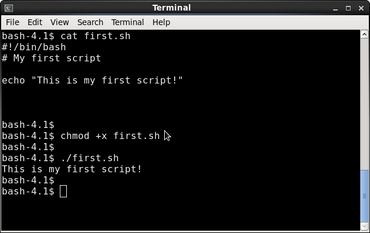

# Shell Scripting

## About this tutorial

Welcome to out local shell scripting introduction. This tutorial was developed using the bash shell.  We tried to demonstrate most of the features with a short example script.  The scripts are shown inside a table; if the table has two columns, the first contains the script and the second contains the output of the script when executed in the bash shell.

## A bash shell script

A bash shell script is a series of commands written in a plain text file.  When a script is executed, all commands are performed in a sequence allowing a user to accomplish multiple or repetitive tasks without much typing.  Scripting can substantially simplify handling of various administration tasks from managing large datasets to setting up complicated workflows. In the HPC setting, scripts are used for submitting jobs to the queue system.

```bash
#!/bin/bash
# My first script
echo "This is my first script!"
```

The script always starts with the "#!/bin/bash" line that tells your system to submit the file content to the appropriate interpreter.  There are various types of shell, this tutorial is using a "bash" shell examples. Any other line starting with "#" is a comment.

The script is typically executed by:

* assigning executable permissions to the script (chmod +x script_name.sh)
* executing the script by typing ./script_name.sh



Note: there are other ways to execute a shell script.  For example, "bash script_name.sh" would also work (in this case, no executable permissions would have to be set).

## Shell scripts as programs

Shell scripts utilise basic programming constructs - variables, control statements and loops - that can turn a simple script into a program in its own right.  This tutorial describes the use of basic building blocks with multiple examples.

### Shell variables

Unix shell and shell scripts allow declaration of variables. Variables can be thought about as containers that are used used to store information.  Each variable has a name and its content can be changed either by an assignment, a string operation or an arithmetic operation.  Variables are essential for writing flexible scripts as they allow processing of varying data by the same script.

Consider the following script that is a modified version of the script first.sh. The string "This is my script!" is now stored in the MESSAGE variable.  The variable is recalled in the echo statement by using the "$MESSAGE" string. 

```bash
#!/bin/bash
# My first script
MESSAGE="This is my first script!"
echo $MESSAGE
```

When declaring variables, following rules have to be observed:

* no spaces are allowed around the the equal sign in the variable declaration line
* variable names have to start with a letter
* no spaces are allowed in the variable name
* no punctuation marks are allowed in the name (underscore is ok)

Shell variables are untyped, essentially, they are strings.  Arithmetic operations are permitted on variables containing only digits.  Floating point operations are not supported (although it possible to use the "bc" operator from the math library).

#### Naked variables
The name of a variable appears naked - without the "$" character - only at assignment (plus few more special cases).  In the rest of the script, the $ is used before the variable name.  In the above example, a missing $ sign would cause the script not recognize that MESSAGE is a variable and print a word "MESSAGE" into the output instead.

#### Curly brackets

The syntax "$MESSAGE" is equal to "${MESSAGE}".  This is actually the proper way to refer to a variable but in most cases we can skip the curly brackets completely.  However, sometime the brackets have to be present. 

Consider the following.  The variable ANAME is set to a value (e.g."data").  The variable BNAME is inititalized to the the value of ANAME with "2" appended at the end (e.g."data2").  However, something goes wrong and BNAME appears not to be set in the example below.  The problem is in the "BNAME=$ANAME2" command.  The "$ANAME2" construct is not interpreted as the value of the variable $ANAME followed by "2" but as a name of a new unset variable "ANAME2".

```bash
bash-4.1$ cat curly.sh
#!/bin/sh

ANAME=data
echo "ANAME: " $ANAME
BNAME=$ANAME2
echo "BNAME: "$BNAME

bash-4.1$ ./curly.sh
ANAME: data
BNAME:
```

The way to correct the script is to enclose the variable ANAME name in curly brackets clearly denoting the variable name.  The variable BNAME is now set properly.

```bash
bash-4.1$ cat curlyplus.sh
#!/bin/sh

ANAME=data
echo "ANAME: " $ANAME
BNAME=${ANAME}2
echo "BNAME: " $BNAME

bash-4.1$ ./curlyplus.sh
ANAME: data
BNAME: data2
```

### Environment variables

Apart from user-defined (or local) variables, there are environment variables that are always set in the current shell.  Typing "printenv" displays all set environment variables. To mention a few, the home directory path is set in the variable $HOME, the current working directory is set in $PWD, the user name in $USER and the shell type in $SHELL.

#### The PATH environment variable

The PATH variable contains a list of directories that are searched every time a user issues a command.  If a command is located with the list of directories, it can be called simply by its name.  If a command is not located, the full path has to be used to evoke it.  For example, all basic Bash commands such as "ls", "cd" or "cp" can be called by their name.  This is because their usual location - "/usr/bin" - is stored in $PATH.

Commands located in current directory often confuse new users. The thinking is that if the command is located in the current directory and has the right permissions, one should be able to simply type the command to execute it.  If this works or not depends on the way the PATH variable is set.

In the example below, the PATH contains several directories. However, none of the directories refers to the current directory.  When the command is called with just a name "first.sh" shell produces an error "command not found" because the current directory is never searched.  For the command to be found, it would have to be called with the path to the current directory - "./first.sh".

```bash
bash-4.1$ echo $PATH
/usr/lib64/qt-3.3/bin:/usr/local/bin:/usr/bin:/bin:/usr/local/sbin:/usr/sbin:/sbin
bash-4.1$ 
bash-4.1$ first.sh
bash: first.sh: command not found
bash-4.1$ ./first.sh
This is my first script!
bash-4.1$
```

We can modify the PATH variable using the following statement: "export PATH=$PATH:/home/user/bin".  This adds "/home/user/bin" to the current value of PATH.

**Caution**: Even though it might appear convenient, one should avoid adding current directory into the system-wide PATH.  The PATH variable should be reserved for system commands and adding "./" could result into an override of a regular command by a malicious local one.

### Pre-set variables
When a script is being executed, one can get access to script arguments using positional parameters.   In addition, one can query exit value of commands and process identifiers. 

Positional parameters
As with the most shell commands, one can pass multiple arguments to a shell script.  The incoming arguments are stored in reserved positional variables.  The name of the script itself is stored in "$0", the first param is "$1", second "$2" and so on.  The variables "$@" and "$*" both hold the complete list of parameters. Finally, the "$#" variable holds the total number of arguments.

```bash
bash-4.1$ cat argvar.sh
#!/bin/sh
echo "I was called with $# parameters"
echo "My path is $0"
echo "My name is `basename $0`"
echo "My first parameter is $1"
echo "My second parameter is $2"
echo "All parameters are $@"

bash-4.1$ cat argvar.sh
#!/bin/sh
echo "I was called with $# parameters"
echo "My path is $0"
echo "My name is `basename $0`"
echo "My first parameter is $1"
echo "My second parameter is $2"
echo "All parameters are $@"
```

Note: Remember to use curly brackets for positional params larger than 9, e.g. param 10 is "${10}".

#### Exit value variable

The "$?" variable holds the exit value of the last executed command.  The convention is that the most unix commands produce zero on successful exit.  The script below shows a simple example of "$?" use.  First, the script attempts to execute "mycomm", then it tests the exit value using "$?".  If the exit is non-zero, an error message is issued.  The syntax of the "if" construct will be explained in detail in the following sections.

```bash
#!/bin/sh
/usr/local/bin/mycomm
if [ "$?" -ne "0" ]
 then
  echo "mycomm failed"
 fi
```

#### Process ID variables

* "$$" is the process ID of the current shell
* "$!" is the process ID of the last background process

These variables can be useful, for example, for generating unique output names when a script is run in many parallel instances.

### Variables continued
#### Scope of variables

Variables declared inside the script exist only during execution of the script. In the example below, the script first.sh sets the variable $MESSAGE to a string "This is my first script!".  After the program is executed, $MESSAGE is no longer set (tested by the "echo $MESSAGE" command ater the script has finished).

```bash
bash-4.1$ cat first.sh
#!/bin/bash
# My first script
MESSAGE="This is my first script!"
echo $MESSAGE

bash-4.1$ ./first.sh
This is my first script!
bash-4.1$ echo $MESSAGE
 
bash-4.1$
```

If there is a need to keep a variable set after a script has finished, one can type "source script.sh" or ". script.sh".  This will cause the script to run in the current shell rather than starting its own shell.  As a result, the changes to the current environment (including the variables) are kept.

```bash
bash-4.1$ echo $MESSAGE

bash-4.1$ . first.sh
This is my first script!
bash-4.1$ echo $MESSAGE
This is my first script!
bash-4.1$
```

Similarly, a variable that is instantiated in the shell is not propagated to the script (as the script runs in a new shell).  The example shows a script that does not set any variable, it only attempts to echo the value of  the variable $MESSAGE. However, $MESSAGE is not accessible to the script (echo produces nothing).  When the script is finished the shell-set variable still exists.

```bash
bash-4.1$ cat echomess.sh
#!/bin/bash
echo $MESSAGE


bash-4.1$ MESSAGE=hello
bash-4.1$ ./echomess.sh


bash-4.1$ echo $MESSAGE 
hello
bash-4.1$
```

However, variables can be declared in the shell in such a way that they will be inherited by the script.  This is accomplished by "exporting" the variable in the shell.

```bash
bash-4.1$ export MESSAGE=hi
bash-4.1$ echo $MESSAGE
hi
bash-4.1$ ./echomess.sh
hi
bash-4.1$
```


#### Default value
A default value for a variable can be specified by using a ":-" construct.  The value is applied if the variable is not set. The following script accepts one argument, if no argument is supplied, a default value "Bob" is used.

```bash
bash-4.1$ cat default.sh
#!/bin/bash
MYNAME=${1:-Bob}
echo "My name is $MYNAME"

bash-4.1$ ./default.sh Kat
My name is Kat
bash-4.1$ ./default.sh
My name is Bob
```

### Empty variable

Variables in bash shell do not have to be declared, every new variable in the script automatically contains an empty string unless it has been assigned a value.  This is convenient but one has to be careful about their variable names.

In the following example, $MYINPUT is instantiated with a value of the first argument and echoed back to the user.  But there is a typing error in the variable name in the echo statement.  This goes unchecked and the interpreter assumes that a new, empty variable $MYIPNUT is referenced and outputs an empty string.  This produces an unexpected code behaviour.  The expected output "You entered hello. " turns into "You entered  .".

```bash
bash-4.1$ cat typo.sh
#!/bin/bash

MYINPUT=$1
echo "You entered $MYIPNUT."


bash-4.1$ ./typo.sh hello
You entered .
bash-4.1$
```

#### Variable no longer wanted
A variable can be "unset" when no longer needed.  This is illustrated in the following example. Note that the variable name does not contain "$" in the unset statement.

```bash
bash-4.1$ cat noneeded.sh
#!/bin/bash
MYVAR="I'm no longer needed."
echo "Before: $MYVAR"
unset MYVAR
echo "After: $MYVAR"

bash-4.1$ ./noneeded.sh
Before: I'm no longer needed.
After:
bash-4.1$
```

#### Arrays of variables

Shell supports an array variable type that can hold multiple values.  An array can be instantiated by listing the elements in round brackets.  Individual elements are accessed using array indices. One can list all elements in the array or a range of the array as shown in following the script.

```bash
bash-4.1$ cat array.sh
#!/bin/bash
MYARRAY=(aa bb cc dd ee ff gg hh)
#list one element
echo ${MYARRAY[0]}
echo ${MYARRAY[1]}
#list all elements
echo ${MYARRAY[*]}
#list all elements
echo ${MYARRAY[@]}
#list a slice
echo ${MYARRAY[@]:1:4}

bash-4.1$ ./array.sh
aa
bb
aa bb cc dd ee ff gg hh
aa bb cc dd ee ff gg hh
bb cc dd ee
bash-4.1$ 
```

#### Quoting and escaping

You might have already noticed that strings with spaces require quotes in variable assignment.  If you forget the quotes the command is misinterpreted and the variable is not set.  In the following example, "good day" is not quoted and the interpreted assumes that the variable assignment ends with the first empty space and tries to look for command called "day".

```bash
bash-4.1$ MYVAR=good day
bash: day: command not found
bash-4.1$ echo $MYVAR

bash-4.1$ MYVAR="good day"
bash-4.1$ echo $MYVAR
good day
bash-4.1$
```

Quoting of simple strings is quite straightforward but special attention is needed when strings contain characters such as $, `, " and \.  Depending on quotes, they might be interpreted literally or have a special meaning.

#### Double and single quotes

The choice of single or double quotes determines interpretation of special characters within quotes.

* Single quotes do not allow interpretation of special characters.  The shell treats the text enclosed in single quotes literally.  However, there is no way to enclose a single quote within single quotes.
* Special characters enclosed in double quotes will be interpreted unless they are escaped. 
* It is possible to mix single and double quotes in one statement.

#### Escaping with backslash

If needed, backslash is used within double quotes to give special characters ($, `, " and \) their literal meaning and to print them as they are; this is called "to escape" a special character.

Special characters, if not escaped, are not printed because they instruct the interpreter to assume that:

* $ denotes a variable
* ` evokes a command execution
* " closes the initial double quote
* \ escapes the next characters

Within single quotes, there is no need to escape special characters since they are not interpreted as a rule.  The following example shows different combinations of special characters and quotes.  They are not too realistic but they illustrate the concept.

```bash
bash-4.1$ VAR=moo
bash-4.1$ echo $VAR  
moo
bash-4.1$ echo "$VAR"     # variable expansion in double quotes
moo
bash-4.1$ echo '$VAR'     # $ is interpreted literally in single quotes, variable is not expanded
$VAR
bash-4.1$ echo "\$VAR"    # $ is escaped in double quotes, variable is not expanded
$VAR
bash-4.1$ echo '$VAR'"'"  # to print a single quote, embed it in double quotes
$VAR'
bash-4.1$ echo '$"`\'     # print special characters literally using single quotes
$"`\
bash-4.1$ echo "\$\"\`\\" # to print special characters in double quotes, use \ to escape
$"`\
bash-4.1$
```


### Test constructs
Sometime, it is desirable that we control a flow of instructions in our script and different blocks of code are executed depending on a result of a condition.  The condition is tested using the if statement.

#### If
The syntax of the if statement is as follows.

```bash
if [ expression ]
then
  # if code
else
  # else code
fi # if backwards
```

If the condition or "[ expression ]" is satisfied, the if-code block is executed. Otherwise, the else-code block is executed.  The whole construct is closed with "fi".

Note that the keyword "then" has to be on a separate line, if on the same line, "then" have to be separated with a semicolon.

```bash
if [ expression ]; then
  # if code
else
  # else code
fi 
```

#### Elif

One can apply additional condition(s) using elif that means "else if".  Else block will catch all situations that were not did not satisfy the conditions above.

if [ expression1 ]; then
  # if code
elif [ expression2 ]; then
  # elif code
else
  # else code
fi 


#### The test command
The "if" keyword is followed by a test expression that is enclosed in square brackets. The expression in evaluated either to zero or one.

The evaluation is triggered by the first square bracket - "[" - that is actually a shell built-in command. On most systems, "[" points to /usr/bin/test.  Every time bash encounters a left square bracket, it translates it into the test command.  For this reason, the left square bracket has to be followed by a space, the same way as a command is separated by a space from its arguments.  All the following items in the expression also have to be separated by spaces as they are all arguments to the test command.  The evaluation ends when the right square bracket is encountered.

```bash
if [ $string1 = $string2 ]
is the same as
if /usr/bin/test $string1 = $string2
```

#### Operators

As other unix commands, the test (or "[") returns zero if the expression is true.  Non-zero return means that the expression evaluated to false. This might be counterntuitive, perhaps the best way to think about it is to remember that test is a command and zero is a successful exit.   When in doubt, write a small script and check the outcome of your test command.

```bash
if [ my_expression ]; then
  echo "it is true"
else
  echo "it is false"
fi 
```

An expression within the test command can use

* string operators
* arithmetic operators
* logical operation
* file tests


The common operators are summarized in the following tables.

| arithmetic operation | meaning |
| -------------------- | ------- |
| -eq | is equal to | 
| -ne | is not equal to |
| -lt | is less than |
| -le | is less than or equal to |
| -gt | is grater than |
| -ge | is greater than or equal to |

Note: Since there is no typing for shell variables, the arithmetic operators are meant for variable that consist only of numbers.  If used on strings they will perform ASCII value comparison or possibly fail.

| string operation | meaning |
| -------------------- | ------- |
| $string1 = $string2 | string1 is equal to string2 | 
| $string1 != $string2 | string1 is not equal to string2 |
| $string1 | variable string1 is not null | 
| -n "$string1" | variable string1 is not null | 
| -z $string1 | variable string1 is null, it has zero length |

Note: To test for variable being null, it is preferable to use "-n" operator with a quoted variable.  In principle all variables could be quoted but in practice the quotes are usually skipped but not for the "-n" operator.

| string operation | meaning |
| -------------------- | ------- |
| ! expression | logical NOT |
| expression1 -a expression2 | logical AND |
| expression1 -o expression2 | logical OR |

| File and directory tests | meaning |
| -------------------- | ------- |
| -e | exists | 
| -f | is a regular file (not directory or device file) | 
| -s | has non-zero size |
| -d | is a directory |
| -w | has write permissions |
| -r | has read permissions |
| -x | is executable |

The following example demonstrates various tests for integers, strings and file paths. It is run with 3 parameters - an integer, a string and a file path.

```bash
#!/bin/sh

if [ $# -ne 3 ]; then
  echo "Usage: `basename $0` integer string path"
  exit
fi

if [ $1 -lt 0 ]
then
  echo "$1 is less than zero"
fi

if [ $1 -gt 0 ]; then
  echo "$1 is greater than zero"
fi

if [ $1 -le 0 ]; then
 echo "$1 is less than or equal to  zero"
fi

if [ $1 -ge 0 ]; then
 echo "$1 is more than or equal to zero"
fi

if [ $2 = 0 ] ; then
 echo "$2 is a string or number \"0\""
fi

if [ $2 = "hello" ]; then
 echo "$2 matches the string \"hello\""
fi

if [ $2 != "hello" ] ; then
 echo "$2 is not the string \"hello\""
fi

if [ -n $2 ]; then
 echo "$2 is of nonzero length"
fi

if [ -f $3 ] ; then
 echo "$3 is a path for an regular file"
else
 echo "$3 either does not exist or is a directory or a device."
fi

if [ -x $3 ] ; then
 echo "$3 is a path of an executable file"
fi

if [ $3 -nt "/etc/passwd" ] ; then
 echo "$3 is a file which is newer than /etc/passwd"
fi
```

#### Extended test
One might encounter a test construct with double square brackets. This is so-called extended test command that allows syntax that is closer to other programming languages.  For example, logical operators && and || can be used instead of -a and -o.

```bash
if [[ expression ]]; then
  # if code
else
  # else code
fi 
```

#### Arithmetic tests

The if statement can be followed by an arithmetic expression.  The syntax is  "if (( expression ))".  The arithmetic expression is evaluated to determine which block of code is to be executed, however, the return values are evaluated differently than the ones produced by the test (or "[") command. If the arithmetic expression produces zero, the return is considered false.  If the result is nonzero, the outcome is true.

Note that inside the arithmetic expression, variable names do not contain "$".

```bash
ZEROVAR=0
ONEVAR=1
if (( ZEROVAR )); then
  echo "true"
else
  echo "false"
fi  # this prints "false" because ZEROVAR is 0

if (( ONEVAR )); then
  echo "true"
else
  echo "false"
fi  # this produces "true" because ONEVAR is 1
```

#### If followed by a command

In principle, "if" can be followed by any command with an exit status.  In this case successful exit (0) means that the condition was satisfied.

```bash
if touch my_file; then
  echo "created my_file"
else
  echo "cannot create my_file"
fi
```

#### Alternative syntax with logical AND and OR

One might encounter an expression containing a test command and logical AND and OR.  This is an equivalent structure to an if statement.  If the condition is satisfied the block following logical AND is executed, if not the block following logical OR is applied.

```bash
[ expression ] && echo "true" || echo "false"
```

### Loops

Loop is a section of code that can be repeated.  The number of iterations is controlled by a list of values or by a condition.

#### For loop

The for loop iterates through a list of values.

```bash
#!/bin/sh
for i in 1 2 3 4 5
do
  echo "Iteration $i."
done
bash-4.1$ ./forloop.sh
Iteration 1.
Iteration 2.
Iteration 3.
Iteration 4.
Iteration 5.
bash-4.1$
```

The list can given using brace expansion.

```bash
#!/bin/sh
for i in {1..5}
do
  echo "Iteration $i."
done
bash-4.1$ ./forloop.sh
Iteration 1.
Iteration 2.
Iteration 3.
Iteration 4.
Iteration 5.
bash-4.1$
```

A list of files/directories (using a wild card) can become the iteration range for a loop.  The following example will print out all files ending with ".txt" in the current directory.

```bash
echo "file list"
for i in *.txt
do
  echo "$i"
done
```

The following loop has no list controlling iterations at all. This is allowed and, in this case, the loop will iterate over the arguments to the main script.

```bash
echo "no argument loop"
for a
do
  echo "arg $a"
done
bash-4.1$ ./noargfor.sh aa bb cc
no argument loop
arg aa
arg bb
arg cc


bash-4.1$ ./noargfor.sh
no argument loop


bash-4.1$ ./noargfor.sh *txt
no argument loop
arg aa.txt
arg alph.txt
arg math.txt
arg myfile.txt
arg salph.txt
arg ualph.txt
arg yourfile.txt
bash-4.1$
```

The number of iterations can be controlled by a variable.  The following example uses the shell command seq (print a sequence of numbers) to control the loop.

```bash
echo "variable iteration control"
for num in $(seq 1 $number); do
    echo $num
done

bash-4.1$ ./forseq.sh
1
2
3
4
5
6
7
8
9
10
```


### While loop

The while loop continues looping until the condition becomes false.  The condition is evaluated using the test command (explained in the if statement section).

```bash
while [ condition ]
do
  echo "condition still true"
done
echo "condition is false"
```

While loop can be used to read lines from a file using redirection from stdin with < operator.

```bash
while read line
do 
  echo $line
done <$filename
```

### Until loop

The until loop will iterate as long as the condition is false.  The condition is tested at the top of the loop.

```bash
until [ condition ]
do 
  echo "condition is still false"
done
 echo "condition is true"
```

The following example uses arithmetic expressions.  A variable is incremented with each iteration of the loop.  The loop terminates as soon as the variable is larger than a set limit.

```bash
LIMIT=10
a=1
until (( a > LIMIT ))
do
 echo $a
 (( a++ ))
done
bash-4.1$ ./until.sh
1
2
3
4
5
6
7
8
9
10
```

### Loop control

It is possible to break out of a loop or skip part of a code in the loop.  Two control commands are available:

* break - terminates the loop
* continue -  forwards to the next iteration, skipping the rest of the code in the cycle

The next example prints number from 1 to 10, the continue statement is used to skip numbers 5 and 7.

```bash
a=0
while [ $a -lt 10 ]
do
  (( a++ ))
  if [ $a -eq 5 ] || [ $a -eq 7 ]
  then
     continue
  fi
  echo $a
done
bash-4.1$ ./while.sh
1
2
3
4
6
8
9
10
```

If break command is used, the last loop terminates as soon as the condition is met.

```bash
a=0
while [ $a -lt 10 ]
do
  (( a++ ))
  if [ $a -eq 6 ]
  then
     break
  fi
  echo $a
done
bash-4.1$ ./while.sh
1
2
3
4
5
```

Consider the following code. Without any loop control statement, it will print x 5 times and y 5 x 5 times.  With a "break" statement inside the inner loop, the inner loop will undergo full iterations only twice, when x > 2 the loop terminates at the break.

```bash
x=0
y=0
while [ $x -lt 5 ]; do
  (( x++ ))
  echo "x   $x"
  while [ $y -lt 5 ]; do
    (( y++ ))
    if [ $x -gt 2 ]; then
      break
    fi
    echo "y $y"
  done
  y=0
done
bash-4.1$ ./break.sh
x   1
y 1
y 2
y 3
y 4
y 5
x   2
y 1
y 2
y 3
y 4
y 5
x   3
x   4
x   5
```

If a script contains nested loops, one can control how many loop levels break (or continue) will affect. In the following code, the break statement changed to "break 2" compared to the script above.  This causes the termination of two loop levels.  The inner and outer loops will iterate fully for x = 1 and 2.  When x > 2, the "break 2" statement in the inner loop terminates both loop levels.

```bash
x=0
y=0
while [ $x -lt 5 ]; do
  (( x++ ))
  echo "x   $x"
  while [ $y -lt 5 ]; do
    (( y++ ))
    if [ $x -gt 2 ]; then
      break 2
    fi
    echo "y $y"
  done
  y=0
done
bash-4.1$ ./break.sh
x   1
y 1
y 2
y 3
y 4
y 5
x   2
y 1
y 2
y 3
y 4
y 5
x   3
```

The same two examples using continue and continue 2. Additional echo was introduced to the end of the outer loop to illustrate the point.  The "continue 2" statement causes the outer loop to skip to the end in the last three iterations.

```bash
x=0
y=0
while [ $x -lt 5 ]; do
  (( x++ ))
  echo "x   $x"
  while [ $y -lt 5 ]; do
    (( y++ ))
    if [ $x -gt 2 ]; then
      continue
    fi
    echo "y $y"
  done
  echo "x again $x"
  y=0
done
bash-4.1$ ./continue.sh
x   1
y 1
y 2
y 3
y 4
y 5
x again 1
x   2
y 1
y 2
y 3
y 4
y 5
x again 2
x   3
x again 3
x   4
x again 4
x   5
x again 5
x=0
y=0
while [ $x -lt 5 ]; do
  (( x++ ))
  echo "x   $x"
  while [ $y -lt 5 ]; do
    (( y++ ))
    if [ $x -gt 2 ]; then
      continue 2
    fi
    echo "y $y"
  done
  echo "x again $x"
  y=0
done
bash-4.1$ ./continue.sh
x   1
y 1
y 2
y 3
y 4
y 5
x again 1
x   2
y 1
y 2
y 3
y 4
y 5
x again 2
x   3
x   4
x   5
```

### Case

The case control structure functions similarly to a multiple if - then statement.  The input variable is tested against several conditions and if the test is successful, the matching block of code is executed. The case has somewhat unique syntax.  It uses unmatched brackets, double semi-colons and "esac" (case backward) closing statement.  The "*)" case is executed if none of the above possibilities match.

```bash
$var="Monday"
case $var in 
    "Monday") echo "New week, new possibilities!";;
    "Friday") echo "TGIF!";;
    *) echo "Hang in there!";;
esac
```

The case can be used, for example, to process script parameters.  The example script below expects either file (-f) or directory (-d) as an input.  The case construct is used to test for incoming parameter flags.  If none is given, the usage info is printed out and the script exits.

```bash
case $1 in
  "-f") echo "Input file - $2";;
  "-d") echo "Input directory - $2";;
   *) echo "`basename $0`:usage: [-f file] | [-d directory]"
      exit 1 ;;
esac
```

### Functions
Shell scripts support functions. A function is a block of code that can be repeatedly called from any place in a script.  One should consider writing function if one uses the same or a very similar code in several places.

Note: Functions can never be empty.  That said, function containing only comments is considered empty.

#### Syntax

The function block must precede the function call in the script.

```bash
#!/bin/sh
myfunction () {
  function code...
}
echo "Script start."
myfunction  # function call
echo "Script end."
```

There are alternative formats, for example the first curly bracket can stand alone on a separate line (C-like).  Another common syntax uses the keyword function.

```bash
function myfunction {
  code...
 }
```

### A simple example

The example demonstrates a definition of a simple function called "fhello". 

```bash
#!/bin/sh

fhello ()
{
    x=3
    echo "Hello from fhello!"
}

x=2
echo "x is $x"
fhello 
echo "x is now $x"
 ./fnctn.sh
x is 2
Hello from fhello!
x is now 3
```


### Variable scope
All variables in shell scripts are global, except the input parameters for the function and parameters specified as "local" inside the function.

Note that, in the example in the above section, the value of x changed in main after being reset inside a function, x is global.  To change this behaviour, the example below declares x and y inside the function as local.  That causes the x and y variables to be inaccessible the main portion of the script.

```bash
#!/bin/sh

fhello ()
{
   local x=3
   local y="hidden"
   echo "Hello from myfunc! The local x is $x. The local y is $y."
}

x=2
echo "x is $x"
fhello
echo "x in main is $x"
echo "y in main is $y"
echo "Done."
./funcvar.sh
x is 2
Hello from myfunc! The local x is 3. The local y is hidden.
x in main is 2
y in main is
Done.
```

The next two examples show the scope of positional parameters. The first example shows that the positional params for the main part of the script are invisible to the function. If they are needed in the function, they can first be saved in a variable in the main.  This variable is accessible inside the function.

```bash
#!/bin/sh

fhello ()
{
   echo "Hello from myfunc! The main args are \"$@\"."
   echo "Saved main args are \"$margs\"."
}

echo "Args to main are \"$@\"."
margs=$@
fhello


bash-4.1$ ./funcvis.sh 1 2 3
Args to main are "1 2 3".
Hello from myfunc! The main args are "".
Saved main args are "1 2 3".
```

The following script calls a function with a set of params. These are accessed using the $@ positional parameter inside function.  The positional param has a local behaviour, in the main part of the script it holds the params to the script and in the function it holds the params to the function.

```bash
#!/bin/sh

fhello ()
{
   echo "Hello from myfunc! My params are \"$@.\""
}

echo "Args to main are $@."
fhello here and there


bash-4.1$ ./funcpos.sh 1 2 3
Args to main are "1 2 3".
Hello from myfunc! My params are "here and there".
```

#### Passing params into functions

As said, the positional params are local to the function.  One can take advantage of $1, $2, ... to capture the values inside the function as shown below.

```bash
#!/bin/sh

fhello ()
{
   echo "Hello from myfunc! My params are \"$@\"."
   echo "First is \"$1\"."
   echo "Second is \"$2\"."
   echo "Third is \"$3\"."
}

echo "Args to main are \"$@\"."
fhello here and there

bash-4.1$ ./funcposind.sh
Args to main are "".
Hello from myfunc! My params are "here and there".
First is "here".
Second is "and".
Third is "there".
```

Alternatively, one can use a shift command in a while loop to access all input values.  Shift is a bash buit-in and it removes the first param from the array of params, so in the next loop iteration, the next param can be called with $1 again.

```bash
#!/bin/sh                                              

fhello ()
{
   echo "Hello from myfunc! My params are \"$@\"."
   counter=0

   while [ $# -gt 0 ]; do
     ((counter++))
     echo "Param $counter: \"$1\""
     shift
   done

}

echo "Args to main are \"$@\"."
fhello here and there
bash-4.1$ ./funcposloop.sh
Args to main are "".
Hello from myfunc! My params are "here and there".
Param 1: "here"
Param 2: "and"
Param 3: "there"
```

#### Return values
A bash function can return an integer between 0 and 255 using the return command that is essentially designed to use the Unix exit status codes. This is a limiting feature that can be overcome as illustrated in the following examples.

The first example demonstrates a use of the return statement.

```bash
#!/bin/sh

fhello ()
{
   
   echo "Hello from myfunc!"
   return 0;
}

fhello
echo "return is $?"
 
bash-4.1$ ./funcsimple.sh
Hello from myfunc!
return is 0
```

If a string or a value larger then 255 is needed as a return, one can use global variable to hold the function return value.  The example below is using a global variable "retval" to get around the limited range of return values.

```bash
#!/bin/sh

multiply ()
{ 
   echo "multiply $1 and $2"
   (( retval = $1 * $2 ))
}

multiply $1 $2
echo "return is $retval"

bash-4.1$ ./funclargeret.sh 80 80
multiply 80 and 80
return is 6400
```

The third example uses a command substitution.  The function echoes the result to the sdout and this is captured in a variable in the main.

Note: Make sure that the function echoes only the result, any other echo would become part of the return.

```bash
#!/bin/sh

multiply ()
{
   (( resval = $1 * $2 ))
   echo $resval
}

prod=`multiply $1 $2`
echo "return is $prod"


bash-4.1$ ./funcsubs.sh 100 100
return is 10000
```

## Sources

The Linux documentation project: [http://tldp.org/](http://tldp.org/)

The Bash hackers wiki: [http://wiki.bash-hackers.org/](http://tldp.org/)

Classic Shell Scripting, A. Robbins, and N.H.F. Beebe

